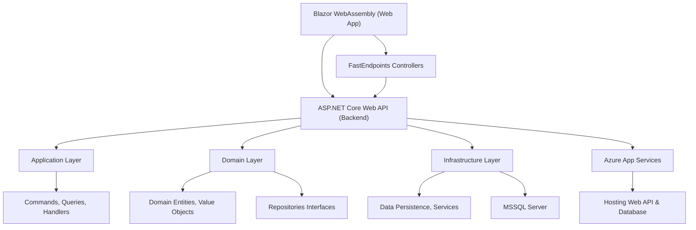

# FurryFriends Solution Documentation

## Introduction

The FurryFriends solution is a Pet Walking/Day Care application that allows users to find and book pet walkers and day care services for their pets. This documentation is intended for intermediate developers who are new to the FurryFriends solution and need to understand its requirements, architecture, design, code, and functionality.

## Requirements

The requirements for the FurryFriends solution are as follows:

-   The application should allow users to find and book pet walkers and day care services for their pets.
-   The application should allow pet walkers and day care providers to register and manage their services.
-   The application should provide a secure and reliable platform for users to interact with each other.
-   The application should be scalable and maintainable.

## Architecture

The FurryFriends solution follows a layered architecture, with the following layers:

-   **Frontend Layer:** Blazor WebAssembly (for web application)
-   **API Layer:** FastEndpoints
-   **Backend Layer:** ASP.NET Core Web API
-   **Application Layer:** Commands, Queries, Handlers, Validators
-   **Domain Layer:** Domain Entities and Value Objects, Repositories Interfaces
-   **Infrastructure Layer:** Data Persistence, Services
-   **Hosting and Deployment:** Azure App Services

The following diagram shows the high-level architecture of the FurryFriends solution:

Each layer is responsible for a specific aspect of the application. The frontend layer is responsible for presenting the user interface. The API layer is responsible for handling API requests. The backend layer is responsible for processing business logic and data. The application layer is responsible for handling application-specific logic. The domain layer is responsible for representing the core business data and rules. The infrastructure layer is responsible for interacting with external systems, such as the database. The hosting and deployment layer is responsible for hosting the application and deploying updates.

## Design

### Data Model

The FurryFriends solution includes the following key entities:

-   **Client:** Represents a client who uses the application to find and book pet walkers and day care services.
    -   Properties: `Id`, `Name`, `Email`, `PhoneNumber`, `Address`, `Pets`, `ClientType`, `PreferredContactTime`, `ReferralSource`, `IsActive`, `DeactivatedAt`
-   **Pet:** Represents a pet owned by a client.
    -   Properties: `Id`, `Name`, `BreedId`, `Age`, `Weight`, `Color`, `IsSterilized`, `MedicalHistory`, `IsVaccinated`, `FavoriteActivities`, `DietaryRestrictions`, `SpecialNeeds`, `Photo`, `IsActive`, `DeactivatedAt`, `OwnerId`, `Owner`, `BreedType`

### User Interface

The FurryFriends solution provides a user-friendly interface for managing pet walkers and clients.

-   **Pet Walker List:** Displays a list of pet walkers with their name, email, city, service areas, and phone number. Allows viewing and editing pet walker information.
-   **Edit Pet Walker Popup:** Provides a form for editing pet walker information, including personal information, professional details, and location information. Allows adding and removing service areas.

### API Endpoints

The FurryFriends solution provides the following API endpoints for managing pet walkers:

-   **Create Pet Walker:** Creates a new pet walker.
    -   Route: `/PetWalker`
    -   Request:
        -   `FirstName` (string): The first name of the pet walker.
        -   `LastName` (string): The last name of the pet walker.
        -   `Email` (string): The email address of the pet walker.
        -   `PhoneCountryCode` (string): The country code of the pet walker's phone number.
        -   `PhoneNumber` (string): The phone number of the pet walker.
        -   `Street` (string): The street address of the pet walker.
        -   `City` (string): The city of the pet walker.
        -   `State` (string): The state of the pet walker.
        -   `Country` (string): The country of the pet walker.
        -   `PostalCode` (string): The postal code of the pet walker.
        -   `Gender` (GenderType.GenderCategory): The gender of the pet walker.
        -   `Biography` (string, optional): The biography of the pet walker.
        -   `DateOfBirth` (DateTime): The date of birth of the pet walker.
        -   `HourlyRate` (decimal): The hourly rate of the pet walker.
        -   `Currency` (string): The currency of the pet walker's hourly rate.
        -   `IsActive` (bool): Whether the pet walker is active.
        -   `IsVerified` (bool): Whether the pet walker is verified.
        -   `YearsOfExperience` (int): The years of experience of the pet walker.
        -   `HasInsurance` (bool): Whether the pet walker has insurance.
        -   `HasFirstAidCertification` (bool): Whether the pet walker has first aid certification.
        -   `DailyPetWalkLimit` (int): The daily pet walk limit of the pet walker.
    -   Response:
        -   `Data` (string): The ID of the newly created pet walker.
        -   `Success` (bool): Whether the request was successful.
        -   `Message` (string): A message describing the result of the request.
        -   `Errors` (List<string>, optional): A list of errors that occurred during the request.
-   **Get Pet Walker by Email:** Gets a pet walker by their email address.
    -   Route: `/PetWalker/email/{email}`
    -   Request:
        -   `Email` (string): The email address of the pet walker to retrieve.
    -   Response:
        -   `Data` (PetWalkerRecord): The pet walker information.
            -   `Id` (Guid): The ID of the pet walker.
            -   `Name` (string): The name of the pet walker.
            -   `Email` (string): The email address of the pet walker.
            -   `CountryCode` (string): The country code of the pet walker's phone number.
            -   `PhoneNumber` (string): The phone number of the pet walker.
            -   `Street` (string): The street address of the pet walker.
            -   `City` (string): The city of the pet walker.
            -   `State` (string): The state of the pet walker.
            -   `ZipCode` (string): The zip code of the pet walker.
            -   `Country` (string): The country of the pet walker.
            -   `Biography` (string): The biography of the pet walker.
            -   `DateOfBirth` (DateTime): The date of birth of the pet walker.
            -   `Gender` (string): The gender of the pet walker.
            -   `HourlyRate` (decimal): The hourly rate of the pet walker.
            -   `Currency` (string): The currency of the pet walker's hourly rate.
            -   `IsActive` (bool): Whether the pet walker is active.
            -   `IsVerified` (bool): Whether the pet walker is verified.
            -   `YearsOfExperience` (int): The years of experience of the pet walker.
            -   `HasInsurance` (bool): Whether the pet walker has insurance.
            -   `HasFirstAidCertification` (bool): Whether the pet walker has first aid certification.
            -   `DailyPetWalkLimit` (int): The daily pet walk limit of the pet walker.
            -   `ServiceLocation` (string): The service location of the pet walker.
            -   `BioPicture` (string): The bio picture of the pet walker.
            -   `Photos` (List<string>): The photos of the pet walker.
        -   `Success` (bool): Whether the request was successful.
        -   `Message` (string): A message describing the result of the request.
        -   `Errors` (List<string>, optional): A list of errors that occurred during the request.
-   **List Pet Walkers:** Lists all pet walkers.
    -   Route: `/PetWalker/list`
    -   Request:
        -   (Inherited from `ListRequestBase`)
            -   `Page` (int, optional): The page number to retrieve.
            -   `PageSize` (int, optional): The number of items per page.
            -   `SearchTerm` (string, optional): The search term to filter the results.
    -   Response:
        -   `Data` (List<PetWalkerListResponseDto>): A list of pet walker information.
            -   `Id` (Guid): The ID of the pet walker.
            -   `Name` (string): The name of the pet walker.
            -   `EmailAddress` (string): The email address of the pet walker.
            -   `City` (string): The city of the pet walker.
            -   `Location` (string): The location of the pet walker.
            -   `PhoneNumber` (string): The phone number of the pet walker.
        -   `PageNumber` (int): The current page number.
        -   `PageSize` (int): The number of items per page.
        -   `TotalCount` (int): The total number of items.
        -   `TotalPages` (int): The total number of pages.
        -   `HasPreviousPage` (bool): Whether there is a previous page.
        -   `HasNextPage` (bool): Whether there is a next page.
-   **Update Pet Walker:** Updates a pet walker.
    -   Route: `/PetWalker/{PetWalkerId:guid}`
    -   Request:
        -   `PetWalkerId` (Guid): The ID of the pet walker to update.
        -   `FirstName` (string): The first name of the pet walker.
        -   `LastName` (string): The last name of the pet walker.
        -   `CountryCode` (string): The country code of the pet walker's phone number.
        -   `PhoneNumber` (string): The phone number of the pet walker.
        -   `Street` (string): The street address of the pet walker.
        -   `City` (string): The city of the pet walker.
        -   `State` (string): The state of the pet walker.
        -   `ZipCode` (string): The zip code of the pet walker.
        -   `Country` (string): The country of the pet walker.
        -   `Biography` (string): The biography of the pet walker.
        -   `DateOfBirth` (DateTime): The date of birth of the pet walker.
        -   `Gender` (int): The gender of the pet walker.
        -   `HourlyRate` (decimal): The hourly rate of the pet walker.
        -   `Currency` (string): The currency of the pet walker's hourly rate.
        -   `IsActive` (bool): Whether the pet walker is active.
        -   `IsVerified` (bool): Whether the pet walker is verified.
        -   `YearsOfExperience` (int): The years of experience of the pet walker.
        -   `HasInsurance` (bool): Whether the pet walker has insurance.
        -   `HasFirstAidCertification` (bool): Whether the pet walker has first aid certification.
        -   `DailyPetWalkLimit` (int): The daily pet walk limit of the pet walker.
        -   `ServiceLocation` (string): The service location of the pet walker.
    -   Response:
        -   `Id` (Guid): The ID of the updated pet walker.

### Code

The `PetWalkerService` class in the `src/FurryFriends.BlazorUI/Services/Implementation/` directory is responsible for communicating with the PetWalker API. It implements the `IPetWalkerService` interface and provides methods for getting, creating, updating, and deleting pet walkers.

The `GetPetWalkersAsync` method retrieves a list of pet walkers from the API. The `GetPetWalkerByEmailAsync` method retrieves a pet walker by their email address. The `CreatePetWalkerAsync` method creates a new pet walker. The `UpdatePetWalkerAsync` method updates an existing pet walker. The `DeletePetWalkerAsync` method deletes a pet walker.

### Functionality

The FurryFriends solution provides the following functionality:

-   **Finding Pet Walkers:** Users can search for pet walkers based on their location, availability, and other criteria.
-   **Booking Pet Walkers:** Users can book pet walkers for specific dates and times.
-   **Managing Pet Walkers:** Pet walkers can register and manage their services, including their availability, rates, and service areas.
-   **Secure Platform:** The FurryFriends solution provides a secure and reliable platform for users to interact with each other.
