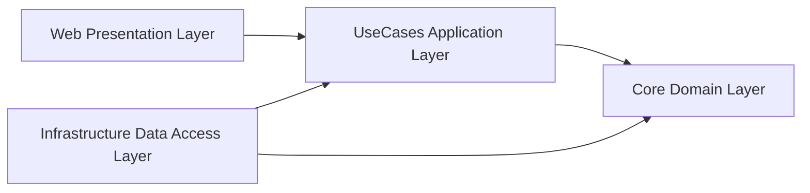
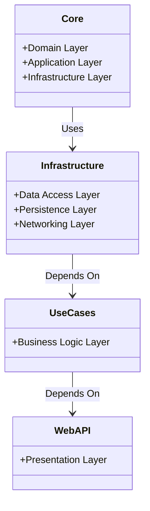

### High-Level Architecture

#### **1. Overview**

- **Frontend**: Blazor WebAssembly (for web application) and Xamarin or .NET MAUI (for mobile application)
- **Backend**: ASP.NET Core Web API
- **Database**: MS SQL Server
- **Hosting**: Azure App Services
- **DevOps**: Azure DevOps for CI/CD

#### **2. Components**

1. **Frontend**
   - **Blazor WebAssembly**: For creating the web application with rich interactivity and performance.
   - **Xamarin or .NET MAUI**: For creating the mobile application (iOS and Android). These frameworks allow code sharing between the web and mobile apps.

2. **Backend**
   - **ASP.NET Core Web API**: This will handle all business logic, data processing, and communication with the database. It will serve as the middle layer between the frontend and the database.

3. **Database**
   - **MS SQL Server**: This will store all the user data, pet data, booking details, and other necessary information. Entity Framework Core can be used for ORM to interact with the database.

4. **Hosting**
   - **Azure App Services**: This will host the web application and API. It provides scalability, automatic updates, and monitoring.

5. **DevOps**
   - **Azure DevOps**: For continuous integration and continuous deployment (CI/CD). It automates the process of building, testing, and deploying applications.

#### **3. Architecture Diagram**

Here’s a high-level architecture diagram:

#### **4. Component Details**

1. **Frontend**
   - **Blazor WebAssembly**: Offers a single-page application (SPA) experience with WebAssembly.
   - **Xamarin / .NET MAUI**: Create native mobile applications with shared codebase.

2. **Backend**
   - **ASP.NET Core Web API**: Handles HTTP requests, processes business logic, communicates with MS SQL, and returns responses to the frontend.

3. **Database**
   - **MS SQL Server**: Stores all structured data with relations, indexes, and transaction support.

4. **Hosting**
   - **Azure App Services**: Hosts the web app and API, ensures high availability, scaling, and security.

5. **DevOps**
   - **Azure DevOps**: Manages source code repositories, pipelines, artifacts, and deployment automation.

#### **5. Security**

- **Authentication & Authorization**: Implement using Azure Active Directory or IdentityServer.
- **Data Protection**: Use encryption for sensitive data at rest and in transit.
- **API Security**: Implement OAuth 2.0 and HTTPS for secure API communication.

This high-level architecture should give you a robust foundation for developing and deploying your Pet Walking/Day Care App. Is there any other specific aspect you'd like to dive deeper into?

