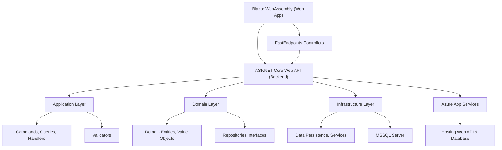

Sure! Here's a more detailed architectural diagram for the Pet Care app:

### Description of Layers and Components

**Frontend Layer:**
- **Blazor WebAssembly**: This client-side framework is used to create the web application, providing a rich, interactive experience with single-page application capabilities.
- **.NET MAUI / Xamarin**: These frameworks are used for creating cross-platform mobile applications, sharing code between iOS and Android versions.

**API Layer:**
- **FastEndpoints**: A framework used to define API endpoints. Each endpoint is in a separate file for better maintainability and organization.

**Backend Layer:**
- **ASP.NET Core Web API**: Handles all the business logic, data processing, and acts as a communication bridge between the frontend and the database.

**Application Layer:**
- **Commands, Queries, Handlers, Validators**: Contains application-specific logic, including the handling of business rules and data manipulation.
  - **Commands**: Define actions to be taken e.g., CreatePetCommand.
  - **Queries**: Define data retrieval requests e.g., GetPetQuery.
  - **Handlers**: Execute the commands and queries e.g., CreatePetHandler, GetPetHandler.
  - **Validators**: Ensure the integrity and validity of the data e.g., CreatePetValidator.

**Domain Layer:**
- **Domain Entities and Value Objects**: Represent the core business data and rules.
  - **Entities**: Main data objects such as Pet, User, etc.
  - **Value Objects**: Immutable types that are defined by their attributes.
- **Repositories Interfaces**: Define the contracts for data access, providing a level of abstraction between the domain layer and the persistence layer.

**Infrastructure Layer:**
- **Data Persistence**: Handles interactions with the MS SQL Server database using Entity Framework Core.
- **Services**: External service integrations, such as payment gateways, email services, etc.

**Hosting and Deployment:**
- **Azure App Services**: Provides scalable, reliable, and secure hosting for the web application, API, and database. It supports continuous deployment and monitoring.

**Security:**
- **Authentication & Authorization**: Managed using Azure Active Directory or IdentityServer to ensure secure access control.
- **Data Protection**: All sensitive data is encrypted both at rest and in transit.
- **API Security**: Enforced through OAuth 2.0 and HTTPS to protect communications between clients and servers.

### Conclusion

This detailed architectural diagram and description should provide your .NET development team with a clear blueprint for designing and implementing the Pet Walking/Day Care App. If you need any more details or have further questions, feel free to ask!