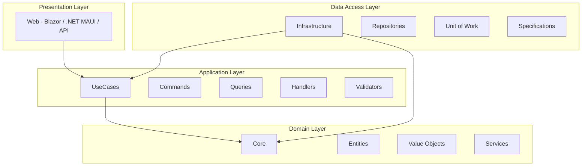

## **Detailed Summary of the Users Bounded Context**

In the context of the Pet Walking App, the **Users** bounded context plays a crucial role. A bounded context in Domain-Driven Design (DDD) is essentially a logical boundary within which a particular domain model applies. For the Users bounded context, this means all functionality related to user management, including pet owners, pet walkers, and administrators, falls under this boundary.
#### **1. Purpose and Scope**

**Purpose**:
The Users bounded context is responsible for managing all user-related activities within the Pet Walking App. This includes user registration, authentication, profile management, user roles, and permissions.

**Scope**:
- **User Registration**: Enabling new users (pet owners and pet walkers) to sign up and create an account.
- **User Authentication**: Handling user login and logout processes, including secure password management.
- **Profile Management**: Allowing users to update their personal information, contact details, and preferences.
- **User Roles and Permissions**: Managing different user roles (e.g., pet owners, pet walkers, administrators) and their associated permissions.
- **Account Recovery**: Providing functionality for users to recover their accounts in case they forget their passwords.

#### **2. Key Entities and Value Objects**

**Entities**:
- **User**: Represents a user in the system, whether they are a pet owner, pet walker, or administrator.
- **Role**: Defines the roles that a user can have, such as pet owner, pet walker, or admin.
- **UserRole**: A linking entity that associates a user with one or more roles.

**Value Objects**:
- **Address**: Represents the user's address information.
- **ContactInfo**: Represents the user's contact details, such as phone number and email address.

#### **3. Aggregate Root**

**User**: The `User` entity serves as the aggregate root for the Users bounded context. This means that all interactions with user-related data should go through the User aggregate.

### **4. Application Layer (UseCases)**

**Commands**:
- **CreateUserCommand**: Command to create a new user.
- **UpdateUserCommand**: Command to update an existing user's details.
- **DeleteUserCommand**: Command to delete a user.

**Queries**:
- **GetUserQuery**: Query to fetch details of a specific user.
- **GetUsersQuery**: Query to fetch a list of users.

**Handlers**:
- **CreateUserHandler**: Handles the creation of new users.
- **UpdateUserHandler**: Handles updating user details.
- **DeleteUserHandler**: Handles deleting users.
- **GetUserHandler**: Handles fetching details of a specific user.
- **GetUsersHandler**: Handles fetching a list of users.

**Validators**:
- **CreateUserValidator**: Validates the data for creating a new user.
- **UpdateUserValidator**: Validates the data for updating user details.

### **5. Infrastructure Layer**

**Repositories**:
- **UserRepository**: Handles data persistence and retrieval for user-related data.
- **RoleRepository**: Handles data persistence and retrieval for role-related data.

**Unit of Work**:
- **IUnitOfWork**: Ensures that all database operations are performed within a transaction, maintaining data consistency.

### **6. Domain Layer**

**Entities**:
- **User**: Represents the user entity with properties such as Id, Name, Email, PhoneNumber, Address, and roles.
- **Role**: Represents a user role with properties such as Id and RoleName.
- **UserRole**: Associates users with roles.

**Value Objects**:
- **Address**: Represents the user's address.
- **ContactInfo**: Represents the user's contact information.

**Services**:
- **UserService**: Contains business logic related to user management.
- **AuthenticationService**: Contains logic for user authentication and authorization.

**Specifications**:
- **UserByEmailSpecification**: Defines criteria for querying users by email.

### **7. API Layer (Presentation Layer)**

**Endpoints**:
- **CreateUserEndpoint**: Endpoint to handle user creation requests.
- **UpdateUserEndpoint**: Endpoint to handle user update requests.
- **DeleteUserEndpoint**: Endpoint to handle user deletion requests.
- **GetUserEndpoint**: Endpoint to fetch a specific user's details.
- **GetUsersEndpoint**: Endpoint to fetch a list of users.

### **Mermaid Diagram for Users Bounded Context**

### **Conclusion**

The Users bounded context in the Pet Walking App encapsulates all functionality related to user management, ensuring that user-related operations are handled within a well-defined boundary. By following Clean Architecture and DDD principles, we ensure that the system is maintainable, scalable, and adheres to best practices for software development.