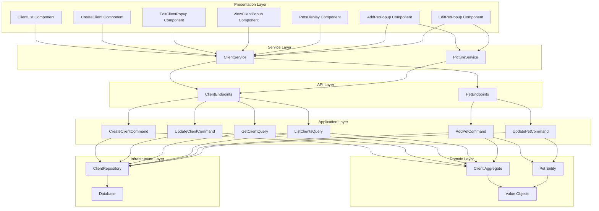
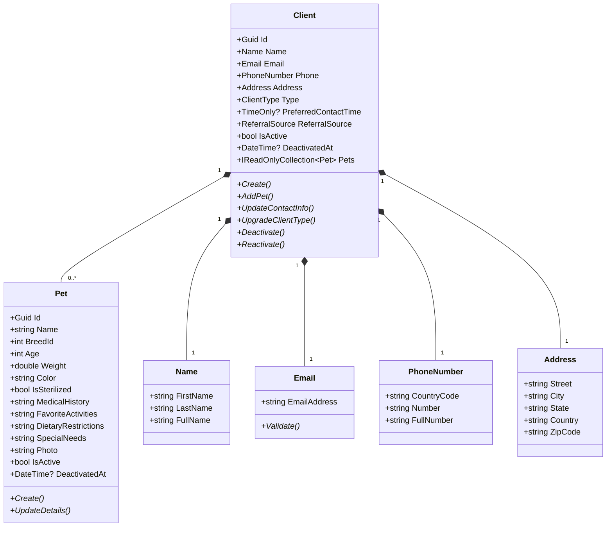
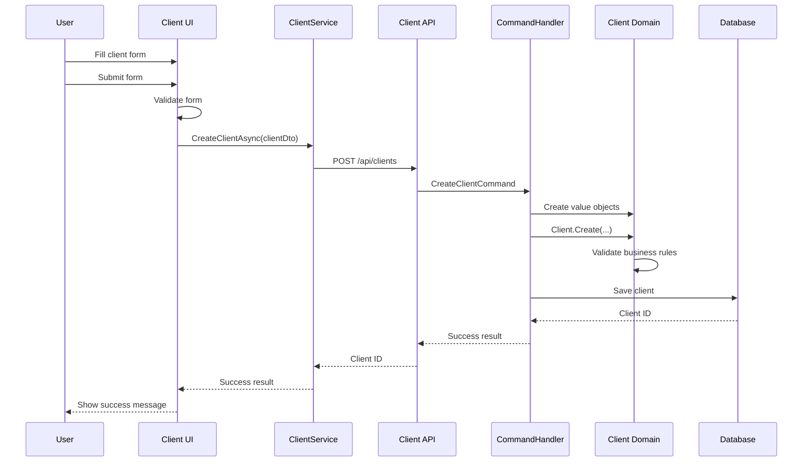
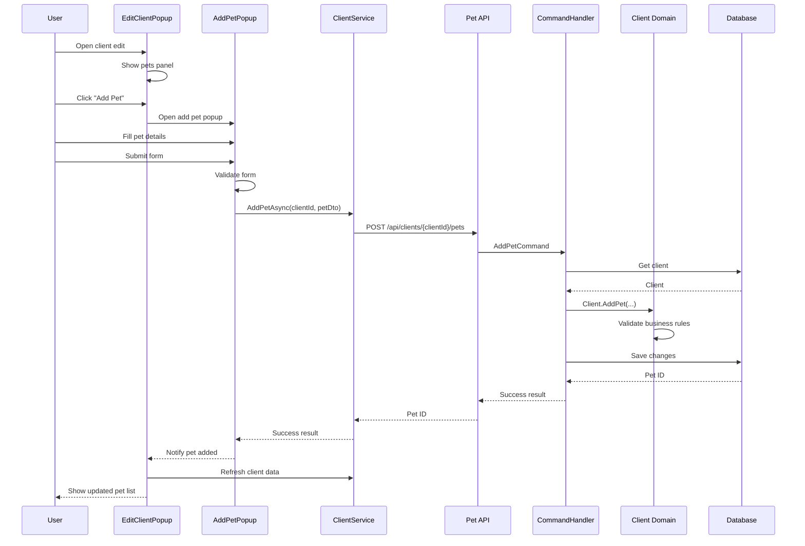

# Client Management Feature Documentation

## Overview

The Client Management feature in FurryFriends allows users to create, view, update, and manage client profiles and their associated pets. This document provides a comprehensive overview of the Client Management feature, including its architecture, components, workflows, and implementation details.

## Feature Capabilities

### Core Functionality

1. **Client Profile Management**
   - Create new client profiles
   - View client details
   - Update client information
   - Deactivate/reactivate clients

2. **Pet Management**
   - Add pets to client profiles
   - View pet details
   - Update pet information
   - Manage pet photos

3. **Client Classification**
   - Categorize clients by type (Regular, Premium, Corporate)
   - Track referral sources
   - Manage preferred contact times

## Architecture

### Component Diagram

### Domain Model

## Workflows

### Client Creation Workflow

### Adding a Pet to a Client

## UI Components

### Client List

The `ClientList` component displays a paginated list of clients with basic information and action buttons for viewing, editing, and managing each client.

Key features:
- Pagination controls
- Search functionality
- Sort by different columns
- Action buttons for each client

### Client Popups

#### View Client Popup

The `ViewClientPopup` component displays detailed client information in a read-only format, including:
- Personal information
- Contact details
- Client classification
- List of pets

#### Edit Client Popup

The `EditClientPopup` component provides a form for editing client information, with the following sections:
- Personal information
- Contact details
- Address
- Client classification
- Pet management panel

### Pet Management Components

#### Pets Display

The `PetsDisplay` component shows a list of pets associated with a client, with options to add, edit, or remove pets.

#### Add/Edit Pet Popups

These components provide forms for adding new pets or editing existing pets, including:
- Basic pet information
- Physical characteristics
- Health information
- Special needs
- Photo upload

## API Endpoints

### Client Endpoints

| Method | Endpoint | Description |
|--------|----------|-------------|
| GET | /api/clients | Get a paginated list of clients |
| GET | /api/clients/{id} | Get a specific client by ID |
| GET | /api/clients/email/{email} | Get a client by email |
| POST | /api/clients | Create a new client |
| PUT | /api/clients/{id} | Update an existing client |
| DELETE | /api/clients/{id} | Deactivate a client |
| POST | /api/clients/{id}/reactivate | Reactivate a client |

### Pet Endpoints

| Method | Endpoint | Description |
|--------|----------|-------------|
| GET | /api/clients/{clientId}/pets | Get all pets for a client |
| GET | /api/clients/pets/{petId} | Get a specific pet by ID |
| POST | /api/clients/{clientId}/pets | Add a pet to a client |
| PUT | /api/clients/pets/{petId} | Update a pet |
| DELETE | /api/clients/pets/{petId} | Deactivate a pet |
| POST | /api/clients/pets/{petId}/photo | Upload a pet photo |

## Validation

### Client Validation Rules

1. **Name**
   - First name and last name are required
   - Maximum length of 50 characters each

2. **Email**
   - Required and must be a valid email format
   - Must be unique in the system

3. **Phone Number**
   - Country code and number are required
   - Must follow valid phone number format

4. **Address**
   - Street, city, state, and zip code are required
   - Country is required

### Pet Validation Rules

1. **Name**
   - Required
   - Maximum length of 50 characters

2. **Breed**
   - Valid breed ID is required

3. **Age**
   - Required
   - Must be a positive number

4. **Weight**
   - Required
   - Must be a positive number

## Business Rules

### Client Business Rules

1. **Pet Limit**
   - Regular clients can have up to 3 pets
   - Premium clients can have up to 10 pets
   - Corporate clients have no limit

2. **Duplicate Pets**
   - Cannot add a pet with the same name and breed as an existing pet

3. **Client Deactivation**
   - Deactivating a client also deactivates all associated pets
   - Deactivated clients cannot be edited or have pets added

### Pet Business Rules

1. **Pet Validation**
   - Pet must have a valid name, breed, age, and weight
   - Pet must be associated with an active client

2. **Pet Photos**
   - Each pet can have one primary photo
   - Photo size and format restrictions apply

## Error Handling

### Common Error Scenarios

1. **Validation Errors**
   - Display validation errors next to the relevant fields
   - Show a summary of errors at the top of the form

2. **API Errors**
   - Handle 400 Bad Request for validation errors
   - Handle 404 Not Found for missing clients or pets
   - Handle 409 Conflict for duplicate emails
   - Handle 500 Internal Server Error for unexpected errors

### Error Messages

Example error messages:
- "A client with this email already exists."
- "Client not found with ID {id}."
- "Pet not found with ID {id}."
- "You have reached the maximum number of pets for your client type."
- "Cannot add a pet with the same name and breed."

## Performance Considerations

1. **Pagination**
   - Client list is paginated to improve performance
   - Default page size is 10 clients
   - Maximum page size is 50 clients

2. **Lazy Loading**
   - Pet details are loaded on demand when viewing a client
   - Pet photos are loaded asynchronously

3. **Caching**
   - Breed list is cached to reduce API calls
   - Client data is cached briefly to improve UI responsiveness

## Security Considerations

1. **Authorization**
   - Only authenticated users can access client management features
   - Role-based access control for different operations

2. **Data Protection**
   - Sensitive client information is protected
   - Client data is validated on both client and server sides

3. **Input Sanitization**
   - All user inputs are sanitized to prevent XSS attacks
   - File uploads are validated for type and size

## Testing Strategy

1. **Unit Tests**
   - Test domain entities and business rules
   - Test validation logic
   - Test command and query handlers

2. **Integration Tests**
   - Test API endpoints
   - Test database operations
   - Test service interactions

3. **UI Tests**
   - Test form validation
   - Test user workflows
   - Test error handling

## Future Enhancements

1. **Advanced Search**
   - Search by multiple criteria
   - Filter by client type, status, etc.

2. **Client History**
   - Track changes to client information
   - View history of client interactions

3. **Bulk Operations**
   - Import/export clients
   - Bulk update client information

4. **Client Portal**
   - Allow clients to view and update their own information
   - Self-service pet management
