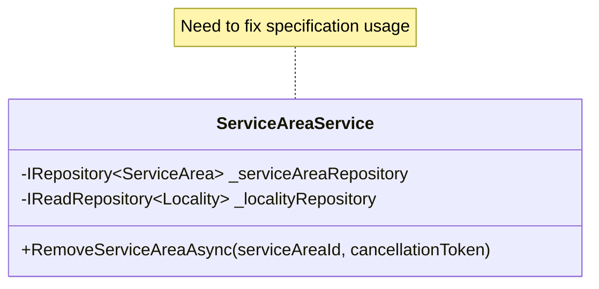
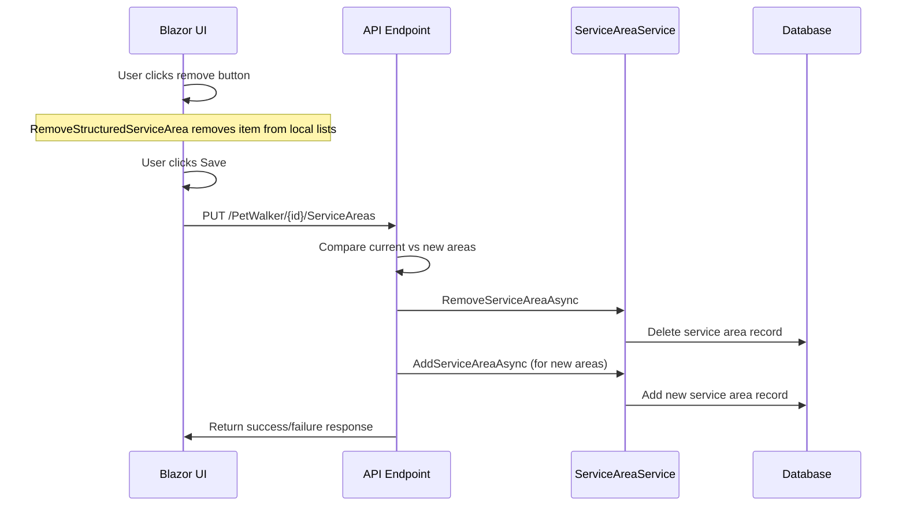

# Service Area Removal Implementation Plan

## Overview
This document outlines the plan for implementing service area removal functionality in the FurryFriends application. The feature will allow users to remove service areas from a pet walker's profile through the UI, with proper handling at the API and database levels.

## Current Implementation Analysis

### UI Layer (Blazor)
- ✅ RemoveStructuredServiceArea method exists in EditPetWalkerPopup.razor.cs
- ✅ UI updates both StructuredServiceAreas and legacy ServiceAreas lists
- ✅ Save functionality calls UpdateServiceAreasAsync with updated list

### API Layer
- ✅ UpdateServiceAreas endpoint correctly identifies areas to add/remove
- ❌ RemoveServiceAreaAsync implementation needs fixing

### Service Layer
- ❌ ServiceAreaService.RemoveServiceAreaAsync uses incorrect specification
- ✅ Basic error handling and logging in place

## Implementation Steps

### 1. Fix ServiceAreaService Implementation



#### Changes Required:
1. Update RemoveServiceAreaAsync method:
   - Replace GetServiceAreaByPetwalkerId specification with direct GetByIdAsync call
   - Improve error messages for better debugging
   - Ensure proper resource cleanup

```csharp
public async Task<Result> RemoveServiceAreaAsync(Guid serviceAreaId, CancellationToken cancellationToken = default)
{
    try
    {
        var serviceArea = await _serviceArearepository.GetByIdAsync(serviceAreaId, cancellationToken);
        if (serviceArea is null)
        {
            return Result.Error($"Service area with ID {serviceAreaId} not found.");
        }

        await _serviceArearepository.DeleteAsync(serviceArea, cancellationToken);
        return Result.Success();
    }
    catch (Exception ex)
    {
        return Result.Error($"Failed to remove service area {serviceAreaId}: {ex.Message}");
    }
}
```

### 2. Complete UpdateServiceAreas Endpoint Implementation
- Remove TODO comment
- Ensure proper error handling for removal operations
- Add detailed logging for troubleshooting

## Testing Plan

### 1. UI Testing
- Test removing a single service area
- Test removing multiple service areas
- Verify UI updates correctly
- Check error message display

### 2. API Testing
- Test successful removal scenarios
- Test removal of non-existent service areas
- Test concurrent removal operations
- Verify error responses

### 3. Database Testing
- Verify service area records are properly deleted
- Check referential integrity
- Verify no orphaned records

### 4. Integration Testing
- Test full flow from UI to database
- Verify state consistency across all layers

## Success Criteria
1. Users can successfully remove service areas through the UI
2. Removed service areas are properly deleted from the database
3. Error handling provides clear feedback
4. No data inconsistencies between UI and database states

## Error Handling
- Clear error messages for all failure scenarios
- Proper logging for debugging
- UI feedback for failed operations

## Sequence Diagram



## Implementation Timeline
1. ServiceAreaService fixes (1 hour)
2. Testing and validation (2 hours)
3. Documentation updates (30 minutes)

## Next Steps
1. Review and approve implementation plan
2. Switch to Code mode for implementation
3. Execute testing plan
4. Deploy changes