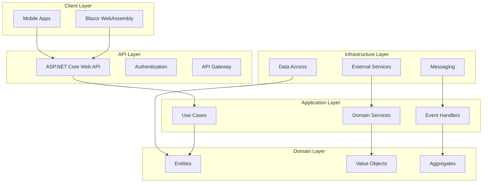
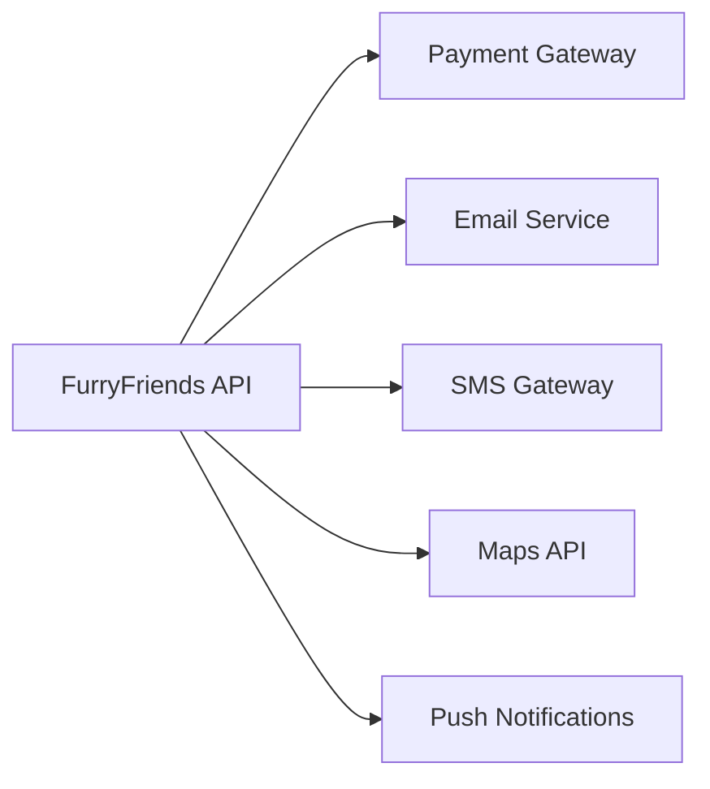
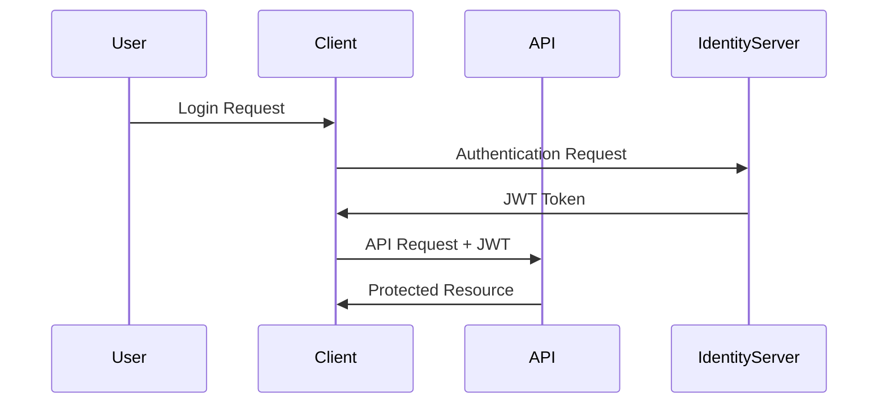
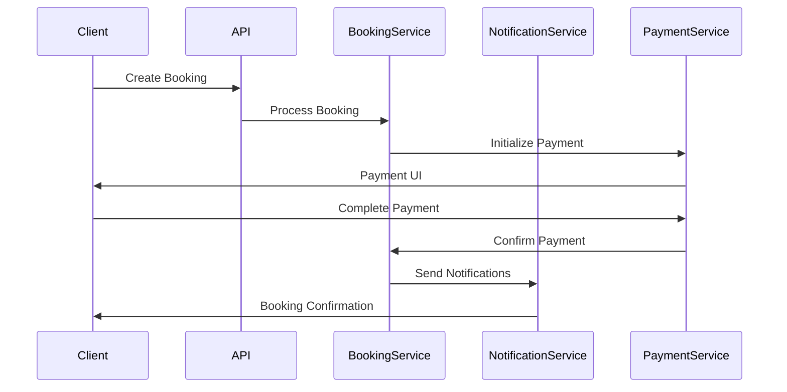
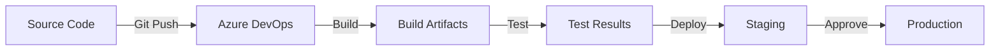

# System Architecture Documentation

## 1. High-Level Architecture Overview

## 2. Technology Stack

### 2.1 Frontend
- **Blazor WebAssembly**
  - Single Page Application (SPA)
  - Progressive Web App (PWA) capabilities
  - Component-based architecture
  - Real-time updates via SignalR

### 2.2 Backend
- **ASP.NET Core 8.0**
  - Clean Architecture principles
  - CQRS pattern with MediatR
  - Domain-Driven Design (DDD)
  - RESTful API design

### 2.3 Data Storage
- **MS SQL Server**
  - Entity Framework Core ORM
  - Code-first migrations
  - Domain-driven schema design
  - Optimized indexing strategy

### 2.4 Cloud Infrastructure
- **Azure Services**
  - App Service for hosting
  - Azure SQL Database
  - Blob Storage for media
  - Azure CDN for static content

## 3. Integration Points

### 3.1 External Services

### 3.2 Third-Party Integrations
- Payment Processing (Stripe/PayFast)
- Email Service (SendGrid)
- SMS Gateway (Twilio)
- Maps Integration (Google Maps)
- Push Notifications (Azure Notification Hubs)

## 4. Security Architecture

### 4.1 Authentication Flow

### 4.2 Security Measures
- JWT-based authentication
- OAuth 2.0 / OpenID Connect
- HTTPS enforcement
- Cross-Origin Resource Sharing (CORS)
- Anti-forgery protection
- Rate limiting

## 5. Data Flow Architecture

### 5.1 Booking Flow

## 6. Deployment Architecture

### 6.1 CI/CD Pipeline

### 6.2 Environment Configuration
- Development
- Testing
- Staging
- Production

## 7. Monitoring and Logging

### 7.1 Application Insights
- Performance monitoring
- Error tracking
- User behavior analytics
- Custom metrics

### 7.2 Logging Strategy
- Structured logging
- Log levels and categories
- Centralized log storage
- Log retention policies

## 8. Scalability and Performance

### 8.1 Caching Strategy
- In-memory caching
- Distributed cache (Redis)
- Output caching
- Entity Framework caching

### 8.2 Performance Optimizations
- CDN integration
- Lazy loading
- Asynchronous operations
- Query optimization