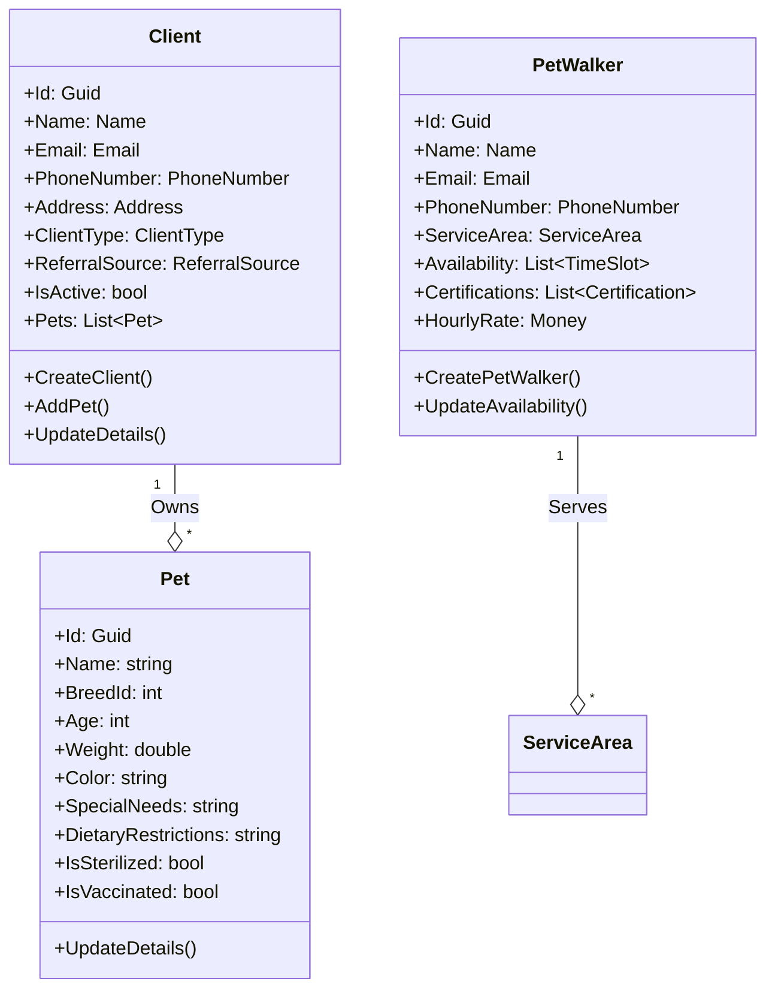
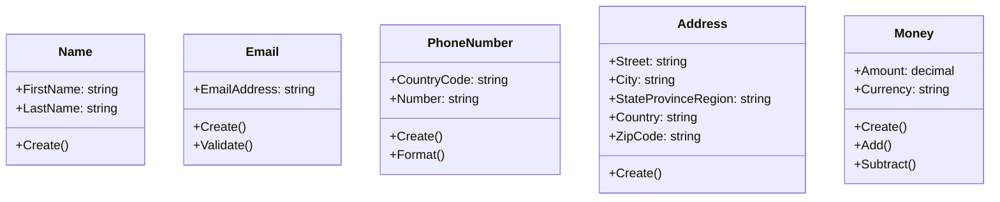
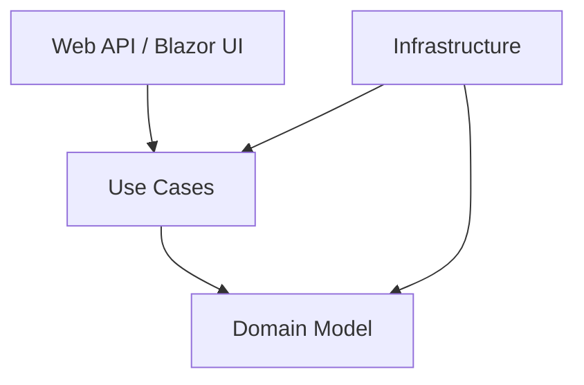
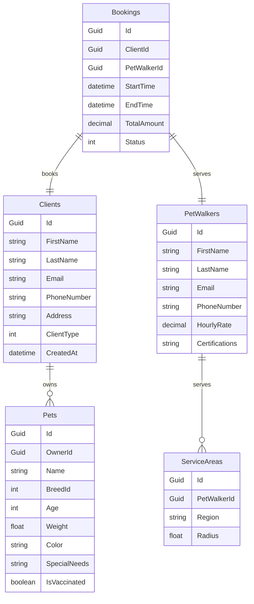
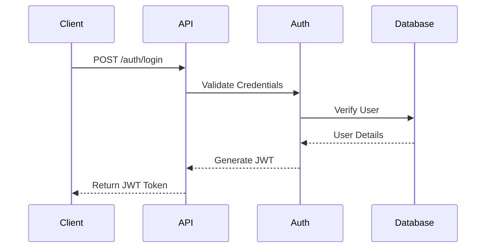

# Design Documentation

## 1. Domain Model

### 1.1 Core Aggregates



### 1.2 Value Objects



## 2. Design Patterns

### 2.1 Clean Architecture
The solution follows Clean Architecture principles with clear separation of concerns:



Layers:
- **Domain Layer**: Core business logic and entities
- **Use Cases Layer**: Application services and business operations
- **Infrastructure Layer**: External concerns (data access, messaging)
- **Presentation Layer**: UI and API endpoints

### 2.2 Domain-Driven Design (DDD)
- **Aggregates**: Client, PetWalker as aggregate roots
- **Value Objects**: Name, Email, PhoneNumber, Address
- **Domain Services**: Booking coordination, payment processing
- **Specifications**: For encapsulating query logic

### 2.3 CQRS Implementation
Commands and Queries are separated:

#### Commands:
- CreateClient
- UpdateClientDetails
- AddPetToClient
- UpdatePetDetails

#### Queries:
- GetClientByEmail
- ListClientsByLocation
- GetPetWalkerAvailability
- ListBookings

## 3. Database Schema



## 4. API Contracts

### 4.1 REST Endpoints

#### Client Management
```yaml
/api/clients:
  post:
    summary: Create new client
    request:
      body:
        name: { firstName, lastName }
        email: string
        phoneNumber: { countryCode, number }
        address: { street, city, state, country, zip }
    response:
      201: { clientId: guid }
      400: { errors: [] }

/api/clients/{email}:
  get:
    summary: Get client by email
    response:
      200: { clientDetails }
      404: { error: string }

/api/clients/{id}/pets:
  post:
    summary: Add pet to client
    request:
      body:
        name: string
        breedId: int
        age: int
        weight: float
    response:
      201: { petId: guid }
      400: { errors: [] }
```

### 4.2 Authentication Flow



## 5. Security Model

### 5.1 Authentication
- JWT-based authentication
- Token expiration and refresh mechanism
- Role-based access control (Client, PetWalker, Admin)

### 5.2 Authorization Policies
```csharp
services.AddAuthorization(options =>
{
    options.AddPolicy("ClientPolicy", policy =>
        policy.RequireRole("Client"));
    
    options.AddPolicy("PetWalkerPolicy", policy =>
        policy.RequireRole("PetWalker"));
        
    options.AddPolicy("AdminPolicy", policy =>
        policy.RequireRole("Admin"));
});
```

### 5.3 Data Protection
- Encryption at rest for sensitive data
- TLS 1.3 for data in transit
- Password hashing using BCrypt
- Input validation and sanitization