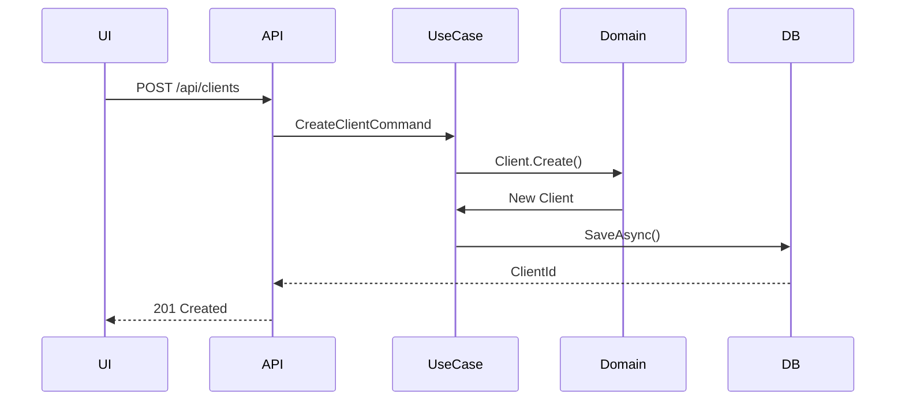
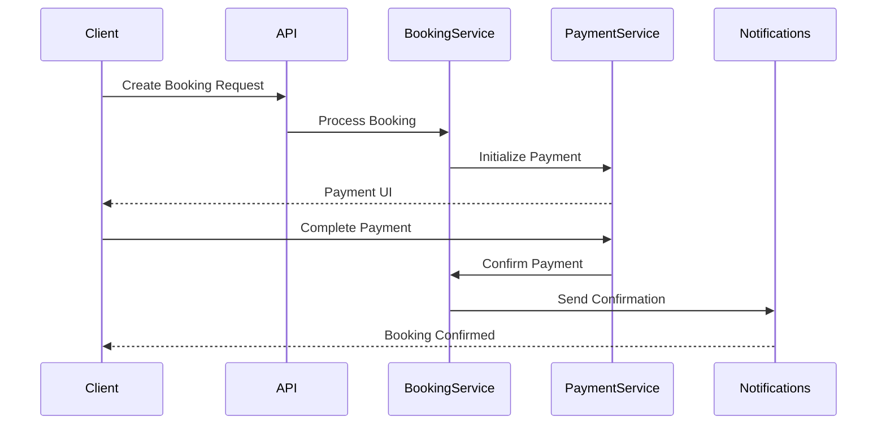

# Implementation Guide

## 1. Code Organization

### 1.1 Project Structure
```
FurryFriends/
├── src/
│   ├── FurryFriends.AspireHost/    # Application host
│   ├── FurryFriends.BlazorUI/      # Frontend interface
│   ├── FurryFriends.Infrastructure/  # Data access and external services
│   ├── FurryFriends.ServiceDefaults/ # Shared service configurations
│   ├── FurryFriends.UseCases/      # Application business logic
│   └── FurryFriends.Web/           # API endpoints
├── tests/
│   ├── FurryFriends.FunctionalTests/
│   ├── FurryFriends.IntegrationTests/
│   └── FurryFriends.UnitTests/
```

### 1.2 Layer Responsibilities

#### Domain Layer (Core)
- Business entities and value objects
- Domain events and interfaces
- Business rules and validations

#### Use Cases Layer
- Application services
- Command and query handlers
- Business operations orchestration

#### Infrastructure Layer
- Database access implementation
- External service integrations
- Email and messaging services

#### Web API Layer
- REST endpoints using FastEndpoints
- Request/response models
- Authentication middleware
- API documentation

## 2. Critical Code Paths

### 2.1 Client Registration Flow


### 2.2 Booking Creation Flow


## 3. Configuration Settings

### 3.1 Application Settings
```json
{
  "ConnectionStrings": {
    "DefaultConnection": "Server=...;Database=FurryFriends;"
  },
  "Cors": {
    "AllowedOrigins": [
      "https://localhost:7214",
      "http://localhost:5185"
    ]
  },
  "Authentication": {
    "JwtKey": "your-secret-key",
    "JwtIssuer": "furry-friends",
    "JwtExpireMinutes": 60
  }
}
```

### 3.2 Middleware Configuration
```csharp
app.UseMiddleware<GlobalExceptionHandlerMiddleware>();
app.UseFastEndpoints(c =>
{
    c.Endpoints.RoutePrefix = "api";
    c.Errors.UseProblemDetails();
});
```

## 4. Build and Deployment

### 4.1 Local Development Setup
1. Prerequisites:
   - .NET 8 SDK
   - SQL Server
   - Visual Studio 2022 or VS Code

2. Database Setup:
```powershell
dotnet ef database update -p src/FurryFriends.Infrastructure -s src/FurryFriends.Web
```

3. Starting the Application:
```powershell
dotnet run --project src/FurryFriends.AspireHost
```

### 4.2 Development Workflow
1. Clone repository
2. Install dependencies
3. Create feature branch
4. Implement changes
5. Run tests
6. Create pull request

### 4.3 Production Deployment
1. Build Process:
```yaml
steps:
  - task: DotNetCoreCLI@2
    inputs:
      command: 'build'
      projects: '**/*.csproj'
      arguments: '--configuration Release'

  - task: DotNetCoreCLI@2
    inputs:
      command: 'test'
      projects: 'tests/**/*.csproj'

  - task: DotNetCoreCLI@2
    inputs:
      command: 'publish'
      publishWebProjects: true
      arguments: '--configuration Release --output $(Build.ArtifactStagingDirectory)'
```

2. Azure Deployment:
```yaml
- task: AzureWebApp@1
  inputs:
    azureSubscription: 'Azure subscription'
    appName: 'furry-friends'
    package: '$(Build.ArtifactStagingDirectory)/**/*.zip'
```

## 5. Coding Standards

### 5.1 Naming Conventions
- PascalCase for classes and methods
- camelCase for variables and parameters
- UPPER_CASE for constants
- Use meaningful, descriptive names

### 5.2 Code Organization
```csharp
// Example class structure
public class ClientService
{
    private readonly IRepository<Client> _repository;
    
    public ClientService(IRepository<Client> repository)
    {
        _repository = repository;
    }
    
    public async Task<Result<Client>> CreateClientAsync(
        Name name,
        Email email,
        PhoneNumber phoneNumber,
        Address address)
    {
        // Implementation
    }
}
```

### 5.3 Error Handling
```csharp
public async Task<Result<Client>> GetClientAsync(string emailAddress)
{
    try
    {
        var client = await _repository.FirstOrDefaultAsync(
            new ClientByEmailSpec(emailAddress));
            
        if (client == null)
            return Result.Error("Client not found");
            
        return Result.Success(client);
    }
    catch (Exception ex)
    {
        _logger.LogError(ex, "Error retrieving client");
        throw;
    }
}
```

## 6. Performance Considerations

### 6.1 Database Optimization
- Proper indexing on frequently queried fields
- Use of efficient querying patterns
- Implementation of caching strategy

### 6.2 Application Performance
- Asynchronous operations
- Efficient memory usage
- Response compression
- Client-side caching

### 6.3 Monitoring
```csharp
builder.Services.AddOpenTelemetry()
    .WithTracing(tracing => tracing
        .AddAspNetCoreInstrumentation()
        .AddHttpClientInstrumentation())
    .WithMetrics(metrics => metrics
        .AddAspNetCoreInstrumentation()
        .AddHttpClientInstrumentation());
```

## 7. Security Implementation

### 7.1 Input Validation
```csharp
public class CreateClientValidator : Validator<CreateClientRequest>
{
    public CreateClientValidator()
    {
        RuleFor(x => x.Email)
            .NotEmpty()
            .EmailAddress();
            
        RuleFor(x => x.PhoneNumber)
            .NotEmpty()
            .Matches(@"^\+[1-9]\d{1,14}$");
    }
}
```

### 7.2 Authentication
```csharp
builder.Services.AddAuthentication(JwtBearerDefaults.AuthenticationScheme)
    .AddJwtBearer(options =>
    {
        options.TokenValidationParameters = new TokenValidationParameters
        {
            ValidateIssuer = true,
            ValidateAudience = true,
            ValidateLifetime = true,
            ValidateIssuerSigningKey = true,
            // Additional parameters
        };
    });
```

## 8. Testing Strategy

### 8.1 Unit Tests
```csharp
public class ClientServiceTests
{
    [Fact]
    public async Task CreateClient_WithValidData_ReturnsSuccess()
    {
        // Arrange
        var repository = new Mock<IRepository<Client>>();
        var service = new ClientService(repository);
        
        // Act
        var result = await service.CreateClientAsync(
            Name.Create("John", "Doe"),
            Email.Create("john@example.com"),
            PhoneNumber.Create("+1", "1234567890"),
            Address.Create("123 Street", "City", "State", "Country", "12345"));
        
        // Assert
        Assert.True(result.IsSuccess);
        repository.Verify(r => r.AddAsync(It.IsAny<Client>()), Times.Once);
    }
}
```

### 8.2 Integration Tests
```csharp
public class ClientEndpointTests : IClassFixture<CustomWebApplicationFactory>
{
    [Fact]
    public async Task CreateClient_ReturnsCreatedResult()
    {
        // Arrange
        var client = _factory.CreateClient();
        var request = new CreateClientRequest { /* ... */ };
        
        // Act
        var response = await client.PostAsync("/api/clients", 
            new StringContent(JsonSerializer.Serialize(request)));
        
        // Assert
        response.StatusCode.Should().Be(HttpStatusCode.Created);
    }
}