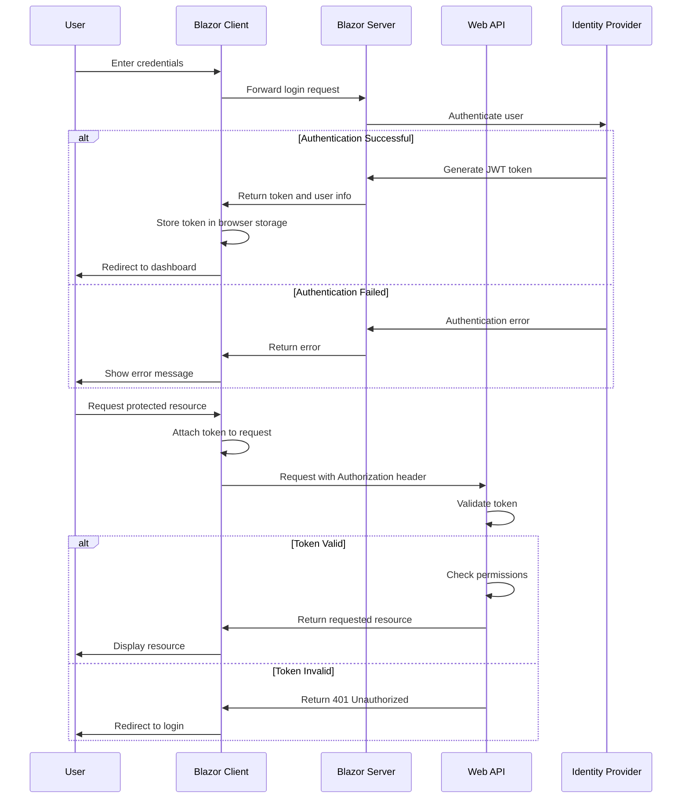

# Authentication and Authorization

## Overview

This document describes the authentication and authorization architecture implemented in the FurryFriends application. The system provides secure access control to application features and data, ensuring that users can only access resources they are authorized to use.

## Authentication Architecture

### Authentication Flow



### Token-Based Authentication

FurryFriends uses JWT (JSON Web Tokens) for authentication:

1. **Token Generation**
   - Tokens are generated upon successful authentication
   - Tokens include user identity and claims
   - Tokens are signed to prevent tampering

2. **Token Storage**
   - Tokens are stored in browser storage (localStorage or sessionStorage)
   - Token expiration is handled automatically

3. **Token Usage**
   - Tokens are included in the Authorization header of API requests
   - Format: `Authorization: Bearer {token}`

### Authentication Components

#### Client-Side Authentication

The Blazor WebAssembly client uses the following components for authentication:

1. **AuthenticationService**
   - Handles login and logout operations
   - Manages token storage and retrieval
   - Provides user identity information

2. **AuthenticationStateProvider**
   - Provides the current authentication state to Blazor components
   - Updates the authentication state when the user logs in or out

3. **HttpClientAuthorizationHandler**
   - Intercepts HTTP requests
   - Adds the authentication token to outgoing requests

#### Server-Side Authentication

The Web API uses the following components for authentication:

1. **JWT Authentication Middleware**
   - Validates incoming JWT tokens
   - Extracts user identity and claims
   - Sets the current user for the request

2. **Identity Service**
   - Manages user accounts and credentials
   - Handles password hashing and verification
   - Generates JWT tokens

## Authorization Architecture

### Role-Based Access Control (RBAC)

FurryFriends implements role-based access control with the following roles:

1. **Administrator**
   - Full access to all features and data
   - Can manage users and roles
   - Can configure system settings

2. **Manager**
   - Can manage clients and pet walkers
   - Can view reports and analytics
   - Limited access to system settings

3. **PetWalker**
   - Can view and update their own profile
   - Can view assigned clients and pets
   - Can manage their schedule and availability

4. **Client**
   - Can view and update their own profile
   - Can manage their pets
   - Can book and manage appointments

### Permission-Based Access Control

In addition to roles, FurryFriends uses fine-grained permissions:

1. **Resource Permissions**
   - Create: Ability to create new resources
   - Read: Ability to view resources
   - Update: Ability to modify existing resources
   - Delete: Ability to remove resources

2. **Feature Permissions**
   - Access to specific features or modules
   - Ability to perform specific actions

### Authorization Components

#### Client-Side Authorization

The Blazor WebAssembly client uses the following components for authorization:

1. **AuthorizeView Component**
   - Conditionally displays UI elements based on authorization
   - Supports role-based and policy-based authorization

2. **Authorize Attribute**
   - Applied to components to restrict access
   - Supports role-based and policy-based authorization

3. **Policy Provider**
   - Defines and evaluates authorization policies
   - Combines multiple requirements for complex scenarios

#### Server-Side Authorization

The Web API uses the following components for authorization:

1. **Authorization Middleware**
   - Evaluates authorization requirements for each request
   - Enforces role-based and policy-based authorization

2. **Policy-Based Authorization**
   - Defines authorization policies
   - Combines multiple requirements for complex scenarios

3. **Resource-Based Authorization**
   - Authorizes actions on specific resources
   - Enforces ownership and access control rules

## Implementation Details

### Authentication Implementation

#### User Login

```csharp
public class AuthService : IAuthService
{
    private readonly HttpClient _httpClient;
    private readonly AuthenticationStateProvider _authStateProvider;
    private readonly ILocalStorageService _localStorage;

    public AuthService(HttpClient httpClient, 
                      AuthenticationStateProvider authStateProvider,
                      ILocalStorageService localStorage)
    {
        _httpClient = httpClient;
        _authStateProvider = authStateProvider;
        _localStorage = localStorage;
    }

    public async Task<LoginResult> Login(LoginModel loginModel)
    {
        var response = await _httpClient.PostAsJsonAsync("api/auth/login", loginModel);
        
        if (!response.IsSuccessStatusCode)
        {
            return new LoginResult { Successful = false, Error = "Invalid username or password" };
        }

        var result = await response.Content.ReadFromJsonAsync<LoginResult>();
        
        if (result.Successful)
        {
            await _localStorage.SetItemAsync("authToken", result.Token);
            ((CustomAuthStateProvider)_authStateProvider).NotifyUserAuthentication(result.Token);
        }

        return result;
    }

    public async Task Logout()
    {
        await _localStorage.RemoveItemAsync("authToken");
        ((CustomAuthStateProvider)_authStateProvider).NotifyUserLogout();
    }
}
```

#### JWT Token Generation

```csharp
public class JwtTokenService : ITokenService
{
    private readonly IConfiguration _configuration;

    public JwtTokenService(IConfiguration configuration)
    {
        _configuration = configuration;
    }

    public string GenerateToken(User user, IList<string> roles)
    {
        var claims = new List<Claim>
        {
            new Claim(ClaimTypes.NameIdentifier, user.Id),
            new Claim(ClaimTypes.Name, user.UserName),
            new Claim(ClaimTypes.Email, user.Email)
        };

        // Add roles as claims
        foreach (var role in roles)
        {
            claims.Add(new Claim(ClaimTypes.Role, role));
        }

        // Add custom claims
        if (user.IsVerified)
        {
            claims.Add(new Claim("IsVerified", "true"));
        }

        var key = new SymmetricSecurityKey(Encoding.UTF8.GetBytes(
            _configuration["JwtSettings:SecretKey"]));
        var creds = new SigningCredentials(key, SecurityAlgorithms.HmacSha256);
        var expiry = DateTime.Now.AddDays(1);

        var token = new JwtSecurityToken(
            issuer: _configuration["JwtSettings:Issuer"],
            audience: _configuration["JwtSettings:Audience"],
            claims: claims,
            expires: expiry,
            signingCredentials: creds
        );

        return new JwtSecurityTokenHandler().WriteToken(token);
    }
}
```

### Authorization Implementation

#### Policy-Based Authorization

```csharp
public static class AuthorizationPolicyExtensions
{
    public static void AddAuthorizationPolicies(this IServiceCollection services)
    {
        services.AddAuthorization(options =>
        {
            // Define policies
            options.AddPolicy("CanManageClients", policy =>
                policy.RequireRole("Administrator", "Manager"));

            options.AddPolicy("CanManagePetWalkers", policy =>
                policy.RequireRole("Administrator", "Manager"));

            options.AddPolicy("CanViewReports", policy =>
                policy.RequireRole("Administrator", "Manager"));

            options.AddPolicy("CanManageOwnProfile", policy =>
                policy.RequireAssertion(context =>
                    context.User.IsInRole("Administrator") ||
                    context.User.IsInRole("Manager") ||
                    context.User.IsInRole("PetWalker") ||
                    context.User.IsInRole("Client")));

            options.AddPolicy("RequireVerifiedPetWalker", policy =>
                policy.RequireRole("PetWalker")
                      .RequireClaim("IsVerified", "true"));
        });
    }
}
```

#### Resource-Based Authorization

```csharp
public class ClientAuthorizationHandler : AuthorizationHandler<OwnershipRequirement, Client>
{
    protected override Task HandleRequirementAsync(
        AuthorizationHandlerContext context,
        OwnershipRequirement requirement,
        Client resource)
    {
        var userId = context.User.FindFirstValue(ClaimTypes.NameIdentifier);

        // Administrators can access any client
        if (context.User.IsInRole("Administrator"))
        {
            context.Succeed(requirement);
            return Task.CompletedTask;
        }

        // Managers can access any client
        if (context.User.IsInRole("Manager"))
        {
            context.Succeed(requirement);
            return Task.CompletedTask;
        }

        // Clients can only access their own profile
        if (context.User.IsInRole("Client") && resource.UserId == userId)
        {
            context.Succeed(requirement);
            return Task.CompletedTask;
        }

        // PetWalkers can access clients assigned to them
        if (context.User.IsInRole("PetWalker") && resource.AssignedPetWalkers.Contains(userId))
        {
            context.Succeed(requirement);
            return Task.CompletedTask;
        }

        return Task.CompletedTask;
    }
}
```

## Security Considerations

### Token Security

1. **Token Expiration**
   - Tokens have a limited lifetime (typically 24 hours)
   - Refresh tokens can be used to obtain new access tokens

2. **Token Revocation**
   - Tokens can be revoked in case of security concerns
   - Logout invalidates tokens

3. **Secure Storage**
   - Tokens are stored securely to prevent theft
   - HttpOnly cookies or secure browser storage

### Password Security

1. **Password Hashing**
   - Passwords are hashed using strong algorithms (bcrypt, Argon2)
   - Salt is used to prevent rainbow table attacks

2. **Password Policies**
   - Minimum length and complexity requirements
   - Regular password rotation
   - Prevention of password reuse

3. **Account Lockout**
   - Accounts are temporarily locked after multiple failed login attempts
   - Notification of suspicious login attempts

### API Security

1. **HTTPS**
   - All API communication uses HTTPS
   - TLS 1.2 or higher is required

2. **CORS**
   - Cross-Origin Resource Sharing is properly configured
   - Only trusted origins are allowed

3. **Rate Limiting**
   - API requests are rate-limited to prevent abuse
   - Different limits for authenticated and anonymous users

## Monitoring and Auditing

### Authentication Logging

All authentication events are logged:

1. **Login Attempts**
   - Successful and failed login attempts
   - Source IP address and user agent
   - Timestamp

2. **Token Operations**
   - Token generation
   - Token validation failures
   - Token revocation

### Authorization Logging

Authorization decisions are logged:

1. **Access Denied Events**
   - Resource being accessed
   - Required permission
   - User identity

2. **Privilege Escalation**
   - Role changes
   - Permission grants
   - Administrative actions

### Security Monitoring

Security events are monitored for suspicious activity:

1. **Unusual Access Patterns**
   - Multiple failed login attempts
   - Access from unusual locations
   - Unusual time of access

2. **Privilege Abuse**
   - Excessive administrative actions
   - Unusual data access patterns
   - Bulk operations

## Configuration

### Authentication Configuration

```json
{
  "JwtSettings": {
    "SecretKey": "your-secret-key-here-at-least-32-characters",
    "Issuer": "furryfriends-api",
    "Audience": "furryfriends-client",
    "ExpiryInDays": 1
  },
  "PasswordPolicy": {
    "RequireDigit": true,
    "RequireLowercase": true,
    "RequireUppercase": true,
    "RequireNonAlphanumeric": true,
    "RequiredLength": 8,
    "RequiredUniqueChars": 4
  },
  "LockoutPolicy": {
    "MaxFailedAttempts": 5,
    "LockoutTimeSpan": "00:15:00"
  }
}
```

### Authorization Configuration

```json
{
  "Authorization": {
    "DefaultPolicy": "CanManageOwnProfile",
    "RequireAuthenticatedUser": true,
    "Roles": [
      {
        "Name": "Administrator",
        "Permissions": ["*"]
      },
      {
        "Name": "Manager",
        "Permissions": [
          "Clients.View",
          "Clients.Create",
          "Clients.Edit",
          "PetWalkers.View",
          "PetWalkers.Create",
          "PetWalkers.Edit",
          "Reports.View"
        ]
      },
      {
        "Name": "PetWalker",
        "Permissions": [
          "Profile.View",
          "Profile.Edit",
          "Schedule.View",
          "Schedule.Edit",
          "AssignedClients.View"
        ]
      },
      {
        "Name": "Client",
        "Permissions": [
          "Profile.View",
          "Profile.Edit",
          "Pets.View",
          "Pets.Create",
          "Pets.Edit",
          "Bookings.View",
          "Bookings.Create",
          "Bookings.Cancel"
        ]
      }
    ]
  }
}
```

## Best Practices

1. **Defense in Depth**
   - Implement multiple layers of security
   - Don't rely solely on authentication for security

2. **Principle of Least Privilege**
   - Grant only the permissions necessary for the task
   - Regularly review and audit permissions

3. **Secure by Default**
   - Resources are private by default
   - Explicit authorization is required for access

4. **Regular Security Reviews**
   - Conduct regular security audits
   - Update security measures as needed

5. **User Education**
   - Educate users about security best practices
   - Provide clear security guidelines
