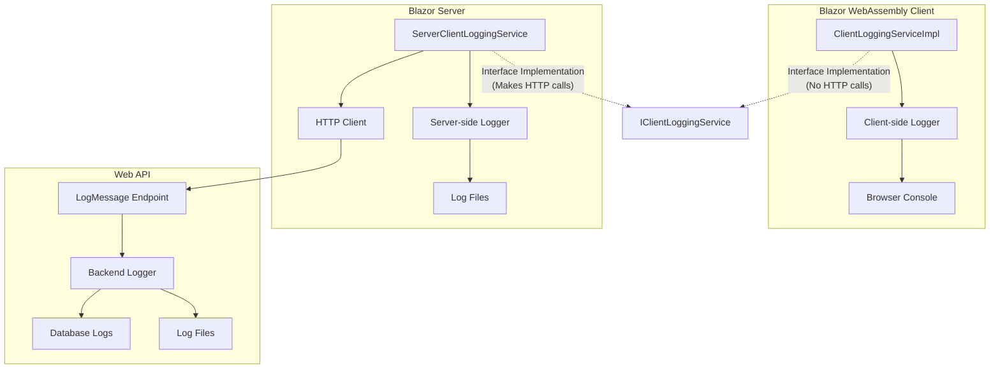
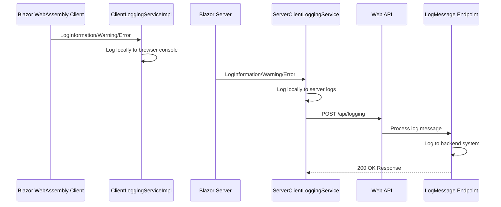

# Logging Architecture Documentation

## Overview

This document describes the logging architecture implemented in the FurryFriends application. The architecture follows a clean separation of concerns between client-side and server-side components, ensuring that the Blazor WebAssembly client does not make direct HTTP calls to external APIs.

## Architecture Diagrams

### Logging Component Diagram

### Logging Sequence Diagram

## Implementation Details

### Client-Side Logging (Blazor WebAssembly)

The client-side logging implementation (`ClientLoggingServiceImpl`) provides a lightweight logging service that only logs locally to the browser console. This implementation does not make any HTTP calls, ensuring that the Blazor WebAssembly client maintains a clean separation from external APIs.

Key features:
- Implements the `IClientLoggingService` interface
- Logs messages locally using the browser's console
- Does not make any HTTP calls
- Registered in the client's DI container

### Server-Side Logging (Blazor Server)

The server-side logging implementation (`ServerClientLoggingService`) handles both local logging and communication with the backend API. This service is responsible for sending logs to the backend API endpoint.

Key features:
- Implements the same `IClientLoggingService` interface
- Logs messages locally to the server's log files
- Makes HTTP calls to the backend API
- Handles errors gracefully (logging failures don't break the application)
- Registered in the server's DI container

### Backend API Endpoint

The backend API provides a dedicated endpoint (`/api/logging`) to receive logs from the server. This endpoint processes and stores logs appropriately in the backend system.

Key features:
- Implemented as a FastEndpoints endpoint
- Accepts log messages with different severity levels
- Stores logs in the backend system
- Returns success/failure responses

## Configuration

### Serilog Configuration

The application uses Serilog for structured logging across all components. The configuration includes:

- Console logging for development
- File logging with daily rolling files
- Configurable log levels
- Enriched context information

## Best Practices Implemented

1. **Separation of Concerns**: Clear separation between client-side and server-side logging
2. **Interface-Based Design**: Common interface (`IClientLoggingService`) with different implementations
3. **Error Handling**: Graceful handling of logging failures
4. **Structured Logging**: Using Serilog for structured, searchable logs
5. **Configuration-Driven**: Log levels and destinations configurable through appsettings.json

## Deployment Considerations

- Ensure log directories exist and have appropriate permissions
- Configure log retention policies to manage disk space
- Consider implementing log aggregation for production environments
