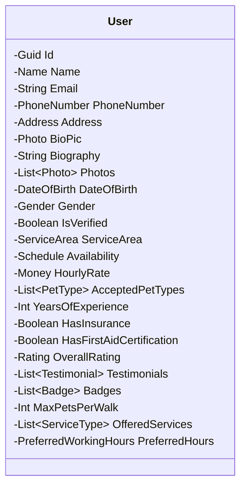

# User Aggregate

The **User Aggregate** represents a pet walker in the FurryFriends system. It encapsulates all data and behavior related to a user, ensuring consistency and enforcing business rules.

## 1. Overview

A User is a domain entity that owns a collection of value objects and aggregates. The aggregate root guarantees that all invariants are preserved during state changes.

## 2. Aggregate Structure

## 3. Value Objects

| Value Object            | Purpose                                           |
| ----------------------- | ------------------------------------------------- |
| `PhoneNumber`           | Encapsulates phone formatting and validation      |
| `Address`               | Stores location details and supports geocoding    |
| `Photo`                 | Represents a user photo with metadata             |
| `PetType`               | Enumerates pet categories the walker accepts      |
| `ServiceType`           | Enumerates services offered (e.g., walk, daycare) |
| `PreferredWorkingHours` | Defines preferred time slots                      |

## 4. Domain Logic

- **Create** – Initializes a new user with mandatory fields.
- **UpdateProfile** – Allows changing personal information while preserving invariants.
- **AddPhoto** – Adds a new photo to the collection.
- **AddTestimonial** – Records client feedback.
- **AddBadge** – Awards badges for achievements.
- **SetAvailability** – Updates the schedule.
- **SetServiceArea** – Defines the geographic area the walker covers.

## 5. Invariants & Business Rules

1. `Email` must be unique across all users.
2. `PhoneNumber` must be valid and formatted.
3. `HourlyRate` must be non‑negative.
4. `MaxPetsPerWalk` cannot exceed the walker’s experience level.
5. `HasFirstAidCertification` is required for walks involving dogs.
6. `OverallRating` is calculated from `Testimonials`.

## 6. Integration Points

- **API Layer** – Exposes CRUD operations via ASP.NET Core Web API.
- **Domain Services** – Handles complex queries such as finding walkers by service area.
- **Event Handlers** – Publishes events when a user is created or updated.
- **External Services** – Integrates with payment gateways for rate management.

## 7. References

- Architecture Overview: [docs/technical/2-architecture.md](docs/technical/2-architecture.md)
- Requirements: [docs/technical/1-requirements.md](docs/technical/1-requirements.md)
