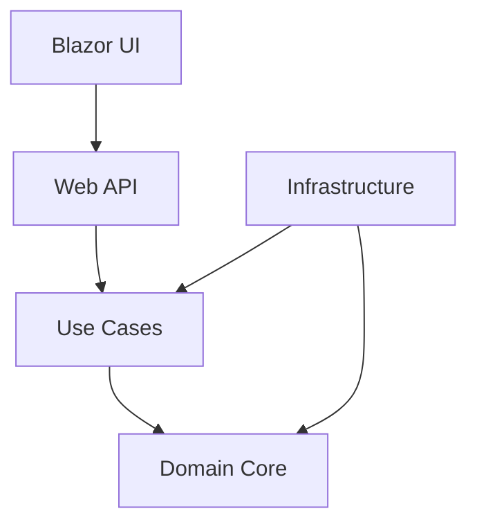

# Blazor and .NET Masterclass: Learning from FurryFriends

## Overview
This masterclass uses the FurryFriends solution as a practical case study to teach intermediate and advanced techniques in Blazor and .NET development. Each section builds upon core concepts to demonstrate real-world implementation patterns.

## Table of Contents
1. [Clean Architecture in Practice](#1-clean-architecture-in-practice)
2. [Domain-Driven Design Implementation](#2-domain-driven-design-implementation)
3. [CQRS and MediatR Patterns](#3-cqrs-and-mediatr-patterns)
4. [Blazor WASM Advanced Techniques](#4-blazor-wasm-advanced-techniques)
5. [Advanced Testing Strategies](#5-advanced-testing-strategies)

## 1. Clean Architecture in Practice

### 1.1 Layer Separation


#### Implementation Example
```csharp
// Domain Layer - Pure business logic
public class Client : BaseEntity, IAggregateRoot
{
    public Name Name { get; private set; }
    public Email Email { get; private set; }
    private readonly List<Pet> _pets = new();
    public IReadOnlyList<Pet> Pets => _pets.AsReadOnly();

    private Client() { } // For EF Core

    public static Client Create(Name name, Email email)
    {
        return new Client
        {
            Name = name,
            Email = email
        };
    }
}

// Use Case Layer - Application logic
public class CreateClientCommand : IRequest<Result<Guid>>
{
    public string FirstName { get; set; }
    public string LastName { get; set; }
    public string Email { get; set; }
}

// Infrastructure Layer - Technical concerns
public class ClientConfiguration : IEntityTypeConfiguration<Client>
{
    public void Configure(EntityTypeBuilder<Client> builder)
    {
        builder.HasKey(c => c.Id);
        builder.OwnsOne(c => c.Name);
        builder.OwnsOne(c => c.Email);
    }
}
```

### 1.2 Dependency Inversion
Learn how FurryFriends implements the Dependency Inversion Principle:

```csharp
// Interface in Domain Layer
public interface IClientRepository
{
    Task<Client> GetByIdAsync(Guid id);
    Task<Client> AddAsync(Client client);
}

// Implementation in Infrastructure Layer
public class EfClientRepository : IClientRepository
{
    private readonly AppDbContext _context;

    public EfClientRepository(AppDbContext context)
    {
        _context = context;
    }

    public async Task<Client> GetByIdAsync(Guid id)
    {
        return await _context.Clients.FindAsync(id);
    }
}

// Registration in Web Layer
services.AddScoped<IClientRepository, EfClientRepository>();
```

## 2. Domain-Driven Design Implementation

### 2.1 Value Objects
```csharp
public class Email
{
    public string EmailAddress { get; private set; }

    private Email() { } // For EF Core

    public static Result<Email> Create(string emailAddress)
    {
        if (string.IsNullOrWhiteSpace(emailAddress))
            return Result.Error<Email>("Email cannot be empty");

        if (!EmailValidator.IsValid(emailAddress))
            return Result.Error<Email>("Invalid email format");

        return Result.Success(new Email { EmailAddress = emailAddress });
    }

    protected override IEnumerable<object> GetEqualityComponents()
    {
        yield return EmailAddress.ToLowerInvariant();
    }
}
```

### 2.2 Aggregate Roots
```csharp
public class PetWalker : BaseEntity, IAggregateRoot
{
    private readonly List<ServiceArea> _serviceAreas = new();
    private readonly List<TimeSlot> _availability = new();

    public IReadOnlyList<ServiceArea> ServiceAreas => _serviceAreas.AsReadOnly();
    public IReadOnlyList<TimeSlot> Availability => _availability.AsReadOnly();

    public Result AddServiceArea(Region region, double radius)
    {
        var serviceArea = ServiceArea.Create(region, radius);
        if (!serviceArea.IsSuccess) return serviceArea;

        _serviceAreas.Add(serviceArea.Value);
        return Result.Success();
    }
}
```

## 3. CQRS and MediatR Patterns

### 3.1 Command Implementation
```csharp
// Command
public class CreateBookingCommand : IRequest<Result<Guid>>
{
    public Guid ClientId { get; set; }
    public Guid PetWalkerId { get; set; }
    public DateTime StartTime { get; set; }
    public DateTime EndTime { get; set; }
}

// Handler
public class CreateBookingCommandHandler : IRequestHandler<CreateBookingCommand, Result<Guid>>
{
    private readonly IBookingRepository _repository;

    public CreateBookingCommandHandler(IBookingRepository repository)
    {
        _repository = repository;
    }

    public async Task<Result<Guid>> Handle(CreateBookingCommand request, CancellationToken token)
    {
        var booking = Booking.Create(request.ClientId, request.PetWalkerId,
            request.StartTime, request.EndTime);

        if (!booking.IsSuccess)
            return Result.Error<Guid>(booking.Error);

        await _repository.AddAsync(booking.Value);
        return Result.Success(booking.Value.Id);
    }
}
```

### 3.2 Query Implementation
```csharp
// Query
public class GetAvailablePetWalkersQuery : IRequest<Result<List<PetWalkerDto>>>
{
    public DateTime Date { get; set; }
    public Location Location { get; set; }
}

// Handler
public class GetAvailablePetWalkersQueryHandler 
    : IRequestHandler<GetAvailablePetWalkersQuery, Result<List<PetWalkerDto>>>
{
    private readonly IReadRepository<PetWalker> _repository;
    private readonly IMapper _mapper;

    public async Task<Result<List<PetWalkerDto>>> Handle(
        GetAvailablePetWalkersQuery request, 
        CancellationToken token)
    {
        var spec = new AvailablePetWalkersSpec(request.Date, request.Location);
        var petWalkers = await _repository.ListAsync(spec);
        return _mapper.Map<List<PetWalkerDto>>(petWalkers);
    }
}
```

## 4. Blazor WASM Advanced Techniques

### 4.1 State Management
```csharp
public class StateContainer
{
    private readonly List<Booking> _bookings = new();
    public IReadOnlyList<Booking> Bookings => _bookings.AsReadOnly();

    public event Action? OnChange;

    public async Task AddBookingAsync(Booking booking)
    {
        _bookings.Add(booking);
        NotifyStateChanged();
    }

    private void NotifyStateChanged() => OnChange?.Invoke();
}
```

### 4.2 Component Communication
```csharp
// Parent Component
@inject StateContainer State

<BookingList Bookings="@State.Bookings" />
<BookingForm OnBookingCreated="@HandleBookingCreated" />

@code {
    private async Task HandleBookingCreated(Booking booking)
    {
        await State.AddBookingAsync(booking);
    }
}

// Child Component
@inject IBookingService BookingService

<EditForm Model="@model" OnValidSubmit="@HandleSubmit">
    <DataAnnotationsValidator />
    // Form fields...
</EditForm>

@code {
    [Parameter]
    public EventCallback<Booking> OnBookingCreated { get; set; }

    private async Task HandleSubmit()
    {
        var result = await BookingService.CreateBookingAsync(model);
        if (result.IsSuccess)
            await OnBookingCreated.InvokeAsync(result.Value);
    }
}
```

### 4.3 JavaScript Interop
```csharp
public class MapService
{
    private readonly IJSRuntime _js;
    
    public async ValueTask InitializeMapAsync(string elementId, Location center)
    {
        await _js.InvokeVoidAsync("mapService.initializeMap", 
            elementId, center.Latitude, center.Longitude);
    }
}

// Usage in Component
@inject MapService MapService
@inject IJSRuntime JS

<div @ref="mapElement" id="map"></div>

@code {
    private ElementReference mapElement;

    protected override async Task OnAfterRenderAsync(bool firstRender)
    {
        if (firstRender)
        {
            await MapService.InitializeMapAsync("map", 
                new Location(-26.2041, 28.0473));
        }
    }
}
```

## 5. Advanced Testing Strategies

### 5.1 Unit Testing Domain Logic
```csharp
public class ClientTests
{
    [Fact]
    public void AddPet_WithValidData_AddsPetToCollection()
    {
        // Arrange
        var client = Client.Create(
            Name.Create("John", "Doe").Value,
            Email.Create("john@example.com").Value);

        // Act
        var result = client.AddPet("Rex", 1, 5, 20.5, "Brown");

        // Assert
        Assert.True(result.IsSuccess);
        Assert.Single(client.Pets);
        Assert.Equal("Rex", client.Pets[0].Name);
    }
}
```

### 5.2 Integration Testing
```csharp
public class BookingIntegrationTests : IClassFixture<CustomWebApplicationFactory>
{
    private readonly CustomWebApplicationFactory _factory;
    
    [Fact]
    public async Task CreateBooking_WithValidData_ReturnsCreatedResponse()
    {
        // Arrange
        var client = _factory.CreateClient();
        var command = new CreateBookingCommand
        {
            ClientId = Guid.NewGuid(),
            PetWalkerId = Guid.NewGuid(),
            StartTime = DateTime.UtcNow.AddDays(1),
            EndTime = DateTime.UtcNow.AddDays(1).AddHours(2)
        };

        // Act
        var response = await client.PostAsJsonAsync("/api/bookings", command);

        // Assert
        response.EnsureSuccessStatusCode();
        Assert.Equal(HttpStatusCode.Created, response.StatusCode);
    }
}
```

### 5.3 Automated UI Testing
```csharp
public class BookingPageTests : TestContext
{
    [Fact]
    public async Task CreateBooking_DisplaysSuccessMessage()
    {
        // Arrange
        var cut = RenderComponent<BookingPage>();
        var bookingService = Services.GetRequiredService<IBookingService>();

        // Act
        await cut.Find("form").SubmitAsync(new Dictionary<string, string>
        {
            ["StartTime"] = "2024-01-01T10:00:00",
            ["EndTime"] = "2024-01-01T12:00:00"
        });

        // Assert
        cut.Find(".alert-success").MarkupMatches(
            "<div class='alert alert-success'>Booking created successfully!</div>");
    }
}
```

## Best Practices and Tips

1. Always implement proper error handling and validation
2. Use strongly-typed configurations
3. Implement proper logging and monitoring
4. Follow SOLID principles
5. Write clean, maintainable code
6. Document your code thoroughly
7. Write comprehensive tests

## Additional Resources

1. [Official Blazor Documentation](https://docs.microsoft.com/aspnet/core/blazor)
2. [Clean Architecture Guide](https://docs.microsoft.com/dotnet/architecture/modern-web-apps-azure/common-web-application-architectures)
3. [Domain-Driven Design Resources](https://github.com/ddd-crew)
4. [MediatR Documentation](https://github.com/jbogard/MediatR/wiki)
5. [Testing Best Practices](https://docs.microsoft.com/aspnet/core/test/integration-tests)

## Exercises

1. Implement a new feature using CQRS pattern
2. Add real-time updates using SignalR
3. Implement advanced state management
4. Create complex UI components
5. Write comprehensive tests

## Conclusion

This masterclass demonstrated how to implement advanced patterns and practices in a real-world application. The FurryFriends solution serves as an excellent example of modern .NET development practices.