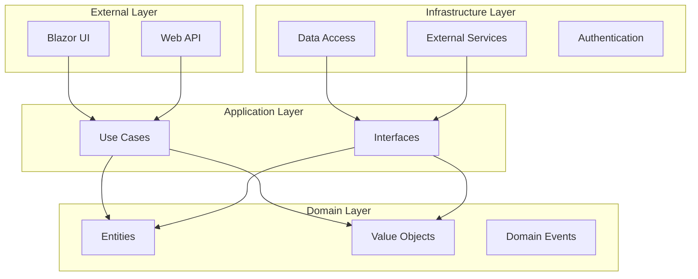

# Part 1: Advanced Architecture

## Clean Architecture in Practice

### Overview

This section examines how FurryFriends implements Clean Architecture, demonstrating how to structure a professional Blazor application for maintainability, testability, and scalability.



### 1. Domain Layer Implementation

#### 1.1 Core Entities
```csharp
// src/FurryFriends.Core/ClientAggregate/Client.cs

public class Client : BaseEntity, IAggregateRoot
{
    private readonly List<Pet> _pets = new();
    
    // Encapsulated properties
    public Name Name { get; private set; }
    public Email Email { get; private set; }
    public IReadOnlyList<Pet> Pets => _pets.AsReadOnly();

    private Client() { } // For EF Core

    // Factory method ensures valid object creation
    public static Result<Client> Create(Name name, Email email)
    {
        if (name == null) return Result.Error<Client>("Name is required");
        if (email == null) return Result.Error<Client>("Email is required");

        return Result.Success(new Client
        {
            Name = name,
            Email = email
        });
    }

    // Domain behavior methods
    public Result<Pet> AddPet(string name, int breedId, int age)
    {
        var pet = Pet.Create(name, breedId, age);
        if (!pet.IsSuccess) return pet;

        _pets.Add(pet.Value);
        return pet;
    }
}
```

#### 1.2 Value Objects
```csharp
public class Email : ValueObject
{
    public string EmailAddress { get; private set; }

    private Email() { } // For EF Core

    public static Result<Email> Create(string emailAddress)
    {
        if (string.IsNullOrWhiteSpace(emailAddress))
            return Result.Error<Email>("Email cannot be empty");

        if (!EmailValidator.IsValid(emailAddress))
            return Result.Error<Email>("Invalid email format");

        return Result.Success(new Email { EmailAddress = emailAddress });
    }

    protected override IEnumerable<object> GetEqualityComponents()
    {
        yield return EmailAddress.ToLowerInvariant();
    }
}
```

### 2. Application Layer Implementation

#### 2.1 Use Cases
```csharp
// src/FurryFriends.UseCases/Services/ClientService/ClientService.cs

public class ClientService : IClientService
{
    private readonly IRepository<Client> _repository;
    private readonly IEventDispatcher _eventDispatcher;

    public ClientService(
        IRepository<Client> repository,
        IEventDispatcher eventDispatcher)
    {
        _repository = repository;
        _eventDispatcher = eventDispatcher;
    }

    public async Task<Result<Client>> CreateClientAsync(
        Name name,
        Email email,
        CancellationToken cancellationToken)
    {
        // Business logic in domain layer
        var clientResult = Client.Create(name, email);
        if (!clientResult.IsSuccess)
            return clientResult;

        // Infrastructure concerns abstracted
        await _repository.AddAsync(clientResult.Value, cancellationToken);
        
        // Domain events
        await _eventDispatcher.DispatchAsync(
            new ClientCreatedEvent(clientResult.Value.Id));

        return clientResult;
    }
}
```

#### 2.2 CQRS Implementation
```csharp
// Commands
public record CreateClientCommand(
    string FirstName,
    string LastName,
    string Email) : IRequest<Result<Guid>>;

public class CreateClientCommandHandler 
    : IRequestHandler<CreateClientCommand, Result<Guid>>
{
    private readonly IClientService _clientService;

    public async Task<Result<Guid>> Handle(
        CreateClientCommand request,
        CancellationToken cancellationToken)
    {
        var nameResult = Name.Create(request.FirstName, request.LastName);
        var emailResult = Email.Create(request.Email);

        if (!nameResult.IsSuccess) return Result.Error<Guid>(nameResult.Error);
        if (!emailResult.IsSuccess) return Result.Error<Guid>(emailResult.Error);

        var result = await _clientService.CreateClientAsync(
            nameResult.Value,
            emailResult.Value,
            cancellationToken);

        return result.IsSuccess 
            ? Result.Success(result.Value.Id)
            : Result.Error<Guid>(result.Error);
    }
}

// Queries
public record GetClientByEmailQuery(string Email) 
    : IRequest<Result<ClientDto>>;

public class GetClientByEmailQueryHandler 
    : IRequestHandler<GetClientByEmailQuery, Result<ClientDto>>
{
    private readonly IReadRepository<Client> _repository;
    private readonly IMapper _mapper;

    public async Task<Result<ClientDto>> Handle(
        GetClientByEmailQuery request,
        CancellationToken cancellationToken)
    {
        var spec = new ClientByEmailSpec(request.Email);
        var client = await _repository.FirstOrDefaultAsync(spec, cancellationToken);

        return client == null
            ? Result.Error<ClientDto>("Client not found")
            : Result.Success(_mapper.Map<ClientDto>(client));
    }
}
```

### 3. Infrastructure Layer Implementation

#### 3.1 Repository Pattern
```csharp
public class EfRepository<T> : IRepository<T> where T : class, IAggregateRoot
{
    private readonly AppDbContext _dbContext;

    public EfRepository(AppDbContext dbContext)
    {
        _dbContext = dbContext;
    }

    public async Task<T> AddAsync(T entity, CancellationToken cancellationToken = default)
    {
        await _dbContext.Set<T>().AddAsync(entity, cancellationToken);
        await _dbContext.SaveChangesAsync(cancellationToken);
        return entity;
    }

    public async Task<T?> GetByIdAsync(Guid id, CancellationToken cancellationToken = default)
    {
        return await _dbContext.Set<T>()
            .FirstOrDefaultAsync(e => EF.Property<Guid>(e, "Id") == id, 
                cancellationToken);
    }
}
```

#### 3.2 Database Configuration
```csharp
public class ClientConfiguration : IEntityTypeConfiguration<Client>
{
    public void Configure(EntityTypeBuilder<Client> builder)
    {
        builder.ToTable("Clients");

        builder.HasKey(c => c.Id);
        
        // Value Object Configuration
        builder.OwnsOne(c => c.Name, n =>
        {
            n.Property(p => p.FirstName)
                .HasColumnName("FirstName")
                .IsRequired()
                .HasMaxLength(50);
                
            n.Property(p => p.LastName)
                .HasColumnName("LastName")
                .IsRequired()
                .HasMaxLength(50);
        });

        builder.OwnsOne(c => c.Email, e =>
        {
            e.Property(p => p.EmailAddress)
                .HasColumnName("Email")
                .IsRequired()
                .HasMaxLength(256);
        });

        // Relationships
        builder.HasMany(c => c.Pets)
            .WithOne()
            .HasForeignKey("ClientId")
            .OnDelete(DeleteBehavior.Cascade);
    }
}
```

### 4. Presentation Layer Implementation

#### 4.1 API Endpoints
```csharp
public class CreateClient : EndpointBaseAsync
    .WithRequest<CreateClientRequest>
    .WithActionResult<Guid>
{
    private readonly IMediator _mediator;

    public CreateClient(IMediator mediator)
    {
        _mediator = mediator;
    }

    [HttpPost("/api/clients")]
    public async Task<ActionResult<Guid>> HandleAsync(
        CreateClientRequest request,
        CancellationToken cancellationToken = default)
    {
        var command = new CreateClientCommand(
            request.FirstName,
            request.LastName,
            request.Email);

        var result = await _mediator.Send(command, cancellationToken);

        return result.IsSuccess
            ? CreatedAtRoute("GetClientById", new { id = result.Value }, result.Value)
            : BadRequest(result.Error);
    }
}
```

#### 4.2 Blazor Components
```csharp
@page "/clients/new"
@inject IMediator Mediator
@inject NavigationManager Navigation

<EditForm Model="@model" OnValidSubmit="@HandleSubmit">
    <DataAnnotationsValidator />
    
    <div class="form-group">
        <label for="firstName">First Name</label>
        <InputText id="firstName" @bind-Value="model.FirstName" class="form-control" />
        <ValidationMessage For="@(() => model.FirstName)" />
    </div>
    
    <div class="form-group">
        <label for="email">Email</label>
        <InputText id="email" @bind-Value="model.Email" class="form-control" />
        <ValidationMessage For="@(() => model.Email)" />
    </div>

    <button type="submit" class="btn btn-primary">Create Client</button>
</EditForm>

@code {
    private CreateClientRequest model = new();

    private async Task HandleSubmit()
    {
        var command = new CreateClientCommand(
            model.FirstName,
            model.LastName,
            model.Email);

        var result = await Mediator.Send(command);
        
        if (result.IsSuccess)
            Navigation.NavigateTo($"/clients/{result.Value}");
    }
}
```

### Best Practices

1. **Domain Layer**
   - Keep domain logic pure and free from infrastructure concerns
   - Use factory methods for entity creation
   - Implement value objects for complex properties
   - Encapsulate collections and state changes

2. **Application Layer**
   - Implement CQRS for clear separation of reads and writes
   - Use interfaces to define dependencies
   - Handle domain events for side effects
   - Keep application services focused on orchestration

3. **Infrastructure Layer**
   - Implement repositories for data access
   - Use specifications for query encapsulation
   - Configure proper database mappings
   - Handle technical concerns (caching, logging, etc.)

4. **Presentation Layer**
   - Keep controllers/endpoints thin
   - Use DTOs for data transfer
   - Implement proper validation
   - Handle errors consistently

### Exercises

1. Add a new domain entity `Review` with appropriate value objects
2. Implement CQRS for the review functionality
3. Create the necessary infrastructure configurations
4. Build Blazor components for review management

### Common Pitfalls

1. Mixing domain logic with infrastructure concerns
2. Exposing domain entities directly to the presentation layer
3. Not properly encapsulating entity state changes
4. Implementing anemic domain models
5. Over-engineering simple CRUD operations

### Additional Resources

1. [Clean Architecture Documentation](../technical/2-architecture.md)
2. [Domain-Driven Design Reference](../technical/3-design.md)
3. [Microsoft Clean Architecture Guide](https://docs.microsoft.com/dotnet/architecture/modern-web-apps-azure/)
4. [CQRS Pattern](https://martinfowler.com/bliki/CQRS.html)

Next section: Real-time Features with SignalR