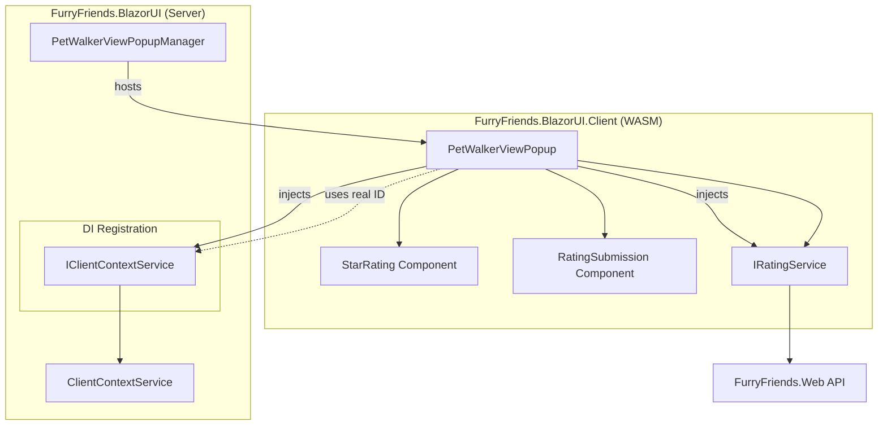

# Plan: Integrate Ratings into PetWalker Detail View

## Context

The rating system (User Story 1) has been fully implemented across all layers:

- Domain entities, events, handlers ✅
- Use cases (Create/Update/Delete/Get Rating, Get Summary) ✅
- API endpoints (POST/GET/PUT/DELETE) ✅
- Reusable Blazor components (`RatingDisplay`, `RatingSubmission`, `PetWalkerRatings`) ✅
- Unit, integration, and bUnit tests ✅

**The remaining gap**: The [`PetWalkerViewPopup`](src/FurryFriends.BlazorUI.Client/Pages/PetWalkers/PetWalkerViewPopup.razor) already has partial rating integration (star display, rating form) but uses [`ClientId="@Guid.NewGuid()"`](src/FurryFriends.BlazorUI.Client/Pages/PetWalkers/PetWalkerViewPopup.razor:205) as a placeholder, and lacks the paginated ratings list.

## Current Architecture

```mermaid
flowchart TD
    subgraph "FurryFriends.BlazorUI (Server)"
        PM[PetWalkerViewPopupManager]
        RS_Server[RatingSubmission Server Component]
        PR[PetWalkerRatings Component]
        CSS[ClientContextService]
        RS_Server --> IR[IRatingService]
        PR --> IR
    end

    subgraph "FurryFriends.BlazorUI.Client (WASM)"
        PVP[PetWalkerViewPopup]
        SR[StarRating Component]
        RS_Client[RatingSubmission Client Page]

        PVP --> SR
        PVP --> RS_Client

        PVP -.->|placeholder| GUID[Guid.NewGuid&#40;&#41;]
    end

    PM -->|hosts| PVP
    PVP -->|injects| IR

    IR --> API[FurryFriends.Web API]
    API --> DB[(Database)]
```



## Desired Architecture



## Files to Modify

| #   | Action     | File                                                                                                                                                               | Description                                                       |
| --- | ---------- | ------------------------------------------------------------------------------------------------------------------------------------------------------------------ | ----------------------------------------------------------------- |
| 1   | **CREATE** | [`src/FurryFriends.BlazorUI.Client/Services/Interfaces/IClientContextService.cs`](src/FurryFriends.BlazorUI.Client/Services/Interfaces/)                           | Interface with `GetCurrentClientIdAsync()`                        |
| 2   | **CREATE** | [`src/FurryFriends.BlazorUI/Services/Implementation/ClientContextService.cs`](src/FurryFriends.BlazorUI/Services/Implementation/)                                  | Server-side impl storing client ID                                |
| 3   | **MODIFY** | [`src/FurryFriends.BlazorUI/Program.cs`](src/FurryFriends.BlazorUI/Program.cs:44-53)                                                                               | Register `IClientContextService`                                  |
| 4   | **MODIFY** | [`src/FurryFriends.BlazorUI.Client/Pages/PetWalkers/PetWalkerViewPopup.razor.cs`](src/FurryFriends.BlazorUI.Client/Pages/PetWalkers/PetWalkerViewPopup.razor.cs)   | Inject IClientContextService, add ratings list + pagination state |
| 5   | **MODIFY** | [`src/FurryFriends.BlazorUI.Client/Pages/PetWalkers/PetWalkerViewPopup.razor`](src/FurryFriends.BlazorUI.Client/Pages/PetWalkers/PetWalkerViewPopup.razor)         | Fix ClientId parameter, add ratings list markup                   |
| 6   | **MODIFY** | [`src/FurryFriends.BlazorUI.Client/Pages/PetWalkers/PetWalkerViewPopup.razor.css`](src/FurryFriends.BlazorUI.Client/Pages/PetWalkers/PetWalkerViewPopup.razor.css) | Add ratings list section styles                                   |
| 7   | **CREATE** | [`tests/FurryFriends.UnitTests/FurrFriends.UnitTests/BlazorUI/PetWalkerViewPopupRatingTests.cs`](tests/FurryFriends.UnitTests/FurrFriends.UnitTests/BlazorUI/)     | bUnit tests for integrated popup                                  |

## Detailed Steps

### Step 1: Create `IClientContextService` abstraction

**Interface** [`src/FurryFriends.BlazorUI.Client/Services/Interfaces/IClientContextService.cs`](src/FurryFriends.BlazorUI.Client/Services/Interfaces/):

```csharp
namespace FurryFriends.BlazorUI.Client.Services.Interfaces;

public interface IClientContextService
{
    Task<Guid> GetCurrentClientIdAsync();
    Task SetCurrentClientIdAsync(Guid clientId);
}
```

**Server Implementation** [`src/FurryFriends.BlazorUI/Services/Implementation/ClientContextService.cs`](src/FurryFriends.BlazorUI/Services/Implementation/):

```csharp
namespace FurryFriends.BlazorUI.Services.Implementation;

public class ClientContextService : IClientContextService
{
    private Guid _currentClientId;

    public Task<Guid> GetCurrentClientIdAsync()
        => Task.FromResult(_currentClientId);

    public Task SetCurrentClientIdAsync(Guid clientId)
    {
        _currentClientId = clientId;
        return Task.CompletedTask;
    }
}
```

**Why**: Creates a seam for future auth integration. When real auth is added, this implementation can be swapped to read from `AuthenticationStateProvider` / JWT claims without changing any consumers.

### Step 2: Register in DI

In [`src/FurryFriends.BlazorUI/Program.cs`](src/FurryFriends.BlazorUI/Program.cs), add alongside existing service registrations:

```csharp
builder.Services.AddScoped<IClientContextService, ClientContextService>();
```

Must be scoped (per-request) since each user session has its own client ID.

### Step 3: Update `PetWalkerViewPopup.razor.cs`

**Changes needed**:

1. Add `IClientContextService` injection
2. Add `_clientId` field resolved from service
3. Add ratings list state: `_ratings`, `_currentPage`, `_totalPages`, `_isLoadingRatings`, `_ratingsError`
4. Add `LoadRatingsAsync()` method calling `RatingService.GetRatingsAsync()`
5. Add `GoToPreviousPage()` / `GoToNextPage()` pagination methods
6. Update `LoadPetWalkerData()` to also resolve client ID
7. Pass resolved `_clientId` to `RatingSubmission` instead of `Guid.NewGuid()`

**Key design decision**: The client ID is resolved once during `OnInitializedAsync` and cached in `_clientId`. This avoids repeated async calls and aligns with the existing pattern where PetWalkerId is resolved once.

### Step 4: Update `PetWalkerViewPopup.razor`

**Changes needed**:

1. Replace `ClientId="@Guid.NewGuid()"` with `ClientId="@_clientId"`
2. Add a "Ratings & Reviews" section below the rating form:
   - Loading state with spinner
   - Empty state ("No ratings yet")
   - Error state with alert
   - Paginated list of rating items (each with stars, author, date, comment)
   - Pagination controls (Previous/Next buttons with page info)

### Step 5: Update CSS

Add styles for:

- `.ratings-section` — container for the ratings list area
- `.ratings-list` — list container
- `.rating-item` — individual rating card
- `.rating-header` — stars + meta row
- `.rating-meta` — author + date
- `.ratings-footer` — pagination row
- `.pagination-controls` — Previous/Next buttons
- `.ratings-empty` / `.ratings-error` / `.ratings-loading` — states

The existing [`PetWalkerRatings.razor.css`](src/FurryFriends.BlazorUI/Components/Pages/Ratings/PetWalkerRatings.razor.css) styles can be adapted.

### Step 6: Add bUnit Tests

**New test file**: [`tests/FurryFriends.UnitTests/FurrFriends.UnitTests/BlazorUI/PetWalkerViewPopupRatingTests.cs`](tests/FurryFriends.UnitTests/FurrFriends.UnitTests/BlazorUI/)

**Test scenarios**:

1. `ShouldResolveClientIdFromService` — Verify `IClientContextService.GetCurrentClientIdAsync()` is called and `ClientId` is not `Guid.Empty`
2. `ShouldLoadAndDisplayRatingSummaryOnInit` — Verify summary is fetched and stars render
3. `ShouldDisplayRatingsListWhenDataExists` — Verify paginated ratings list renders
4. `ShouldShowEmptyStateWhenNoRatings` — Verify empty state message appears
5. `ShouldNavigatePagesInRatingsList` — Verify Previous/Next pagination works
6. `ShouldRefreshSummaryAfterRatingSubmitted` — Verify `HandleRatingSubmitted` reloads summary
7. `ShouldShowErrorStateWhenRatingsFailToLoad` — Verify error message displays

**Note**: The current [`PetWalkerViewPopup`](src/FurryFriends.BlazorUI.Client/Pages/PetWalkers/PetWalkerViewPopup.razor) uses `@rendermode InteractiveAuto` and is in the Client project, making bUnit testing more complex since it requires server interactivity. The test should mock `IJSRuntime` and all injected dependencies, rendering the component directly without the server render mode.

### Step 7: Build & Test

```bash
dotnet build src/FurryFriends.BlazorUI.Client
dotnet build src/FurryFriends.BlazorUI
dotnet test tests/FurryFriends.UnitTests --filter "FullyQualifiedName~BlazorUI.PetWalkerViewPopup"
dotnet test tests/FurryFriends.UnitTests --filter "FullyQualifiedName~BlazorUI.Rating"
dotnet test tests/FurryFriends.FunctionalTests --filter "FullyQualifiedName~Rating"
```

## Data Flow

```mermaid
sequenceDiagram
    participant User
    participant PVP as PetWalkerViewPopup
    participant CCS as ClientContextService
    participant RSvc as RatingService
    participant API as Web API

    User->>PVP: Opens PetWalker popup
    PVP->>CCS: GetCurrentClientIdAsync&#40;&#41;
    CCS-->>PVP: clientId

    PVP->>RSvc: GetRatingSummaryAsync&#40;petWalkerId&#41;
    RSvc->>API: GET /petwalkers/{id}/ratings/summary
    API-->>RSvc: RatingSummaryDto
    RSvc-->>PVP: AverageRating, TotalRatings

    PVP->>RSvc: GetRatingsAsync&#40;petWalkerId, page 1&#41;
    RSvc->>API: GET /petwalkers/{id}/ratings?page=1
    API-->>RSvc: List&#60;RatingDto&#62;
    RSvc-->>PVP: PaginatedRatingResponse

    Note over PVP: Renders stars, count, ratings list

    User->>PVP: Submits rating (score + comment)
    PVP->>RSvc: CreateRatingAsync&#40;CreateRatingRequest&#41;
    RSvc->>API: POST /api/ratings
    API-->>RSvc: RatingResult&#40;isSuccess&#41;
    RSvc-->>PVP: RatingResult

    PVP->>RSvc: GetRatingSummaryAsync&#40;petWalkerId&#41; [refresh]
    RSvc-->>PVP: Updated summary

    Note over PVP: Re-renders with new average
```



## Dependencies & Risks

| Risk                                                                   | Mitigation                                                                                                                    |
| ---------------------------------------------------------------------- | ----------------------------------------------------------------------------------------------------------------------------- |
| `InteractiveAuto` render mode complicates bUnit testing                | Mock `IJSRuntime` and test component logic in isolation; integration-level testing via functional tests covers the full stack |
| `ClientContextService` is a stopgap until real auth                    | Interface is designed to be swapped; tests mock the interface, not the implementation                                         |
| Pagination in PetWalkerViewPopup duplicates PetWalkerRatings component | Purposefully inline to avoid cross-project component reference issues; styles are adapted from the existing component         |
| No existing bUnit tests for PetWalkerViewPopup                         | Start with focused tests that mock all dependencies; follow patterns from `RatingSubmissionTests` and `PetWalkerRatingsTests` |

## Completion Signal

After all steps are completed, run:

1. `dotnet build` — must succeed with 0 errors
2. All rating-related tests pass (unit, bUnit, functional)
3. Run `gitnexus_detect_changes()` to verify no unexpected side effects

Signal completion via `attempt_completion` with a summary of changes made and test results.
