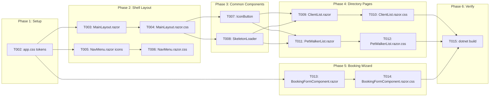

# Implementation Plan: Enterprise UI Modernization

**Branch**: `010-ui-modernization` | **Date**: 2026-05-23
**Spec**: [`specs/010-ui-modernization/spec.md`](../specs/010-ui-modernization/spec.md)
**Plan**: [`specs/010-ui-modernization/plan.md`](../specs/010-ui-modernization/plan.md)
**Tasks**: [`specs/010-ui-modernization/tasks.md`](../specs/010-ui-modernization/tasks.md)

---

## Current State Analysis

Before implementation, here's what I've discovered about the existing codebase:

| File                                                                                                                       | Current State                                                                          | Changes Needed                                                                                              |
| -------------------------------------------------------------------------------------------------------------------------- | -------------------------------------------------------------------------------------- | ----------------------------------------------------------------------------------------------------------- |
| [`App.razor`](../src/FurryFriends.BlazorUI/Components/App.razor)                                                           | Already has Inter font + FontAwesome 6.4.0 linked                                      | **T001 is already done** — no changes needed                                                                |
| [`app.css`](../src/FurryFriends.BlazorUI/wwwroot/app.css)                                                                  | Has basic HSL tokens, utility classes, scrollbar, table/form/card/button styles        | Needs expanded design tokens, glassmorphism, elevated shadows, utility spacing classes                      |
| [`MainLayout.razor`](../src/FurryFriends.BlazorUI/Components/Layout/MainLayout.razor)                                      | Already has modern structure (search bar, notification bell, user avatar/menu, logout) | Needs refinement of shell hierarchy, profile dropdown, animated notification badge                          |
| [`MainLayout.razor.css`](../src/FurryFriends.BlazorUI/Components/Layout/MainLayout.razor.css)                              | Basic layout with flex, sidebar, header, content                                       | Needs backdrop filters, overlay alignments, modern shell dimensions                                         |
| [`NavMenu.razor`](../src/FurryFriends.BlazorUI/Components/Layout/NavMenu.razor)                                            | Uses emoji icons: 📄🚶📅🧪📊⚙️                                                         | Replace with FontAwesome: `fa-users`, `fa-person-walking`, `fa-calendar-days`, `fa-chart-simple`, `fa-gear` |
| [`NavMenu.razor.css`](../src/FurryFriends.BlazorUI/Components/Layout/NavMenu.razor.css)                                    | Very basic (5 rules, hardcoded colors)                                                 | Complete rewrite with pill active states, transitions, spacing                                              |
| [`Icon.razor`](../src/FurryFriends.BlazorUI.Client/Components/Common/Icon.razor)                                           | Simple existing wrapper component                                                      | Keep as-is, referenced by new components                                                                    |
| **SkeletonLoader**                                                                                                         | **Does not exist**                                                                     | Create new reusable component                                                                               |
| **IconButton**                                                                                                             | **Does not exist**                                                                     | Create new reusable component                                                                               |
| [`ClientList.razor`](../src/FurryFriends.BlazorUI.Client/Pages/Clients/ClientList.razor)                                   | Uses emoji actions 👁️✏️+🐾, inline styles, basic HTML table                            | Replace emojis with IconButton, integrate SkeletonLoader, use CSS classes                                   |
| [`ClientList.razor.css`](../src/FurryFriends.BlazorUI.Client/Pages/Clients/ClientList.razor.css)                           | Basic styles, has unusual `::deep body` background image                               | Replace with modern table borders, hover highlights, responsive flex                                        |
| [`PetWalkerList.razor`](../src/FurryFriends.BlazorUI.Client/Pages/PetWalkers/PetWalkerList.razor)                          | Uses emoji actions 👁️✏️🖼️, inline styles, basic HTML table                             | Replace emojis with IconButton, integrate SkeletonLoader, use CSS classes                                   |
| [`PetWalkerList.razor.css`](../src/FurryFriends.BlazorUI.Client/Pages/PetWalkers/PetWalkerList.razor.css)                  | Very basic (24 lines)                                                                  | Modern table styling matching ClientList                                                                    |
| [`BookingFormComponent.razor`](../src/FurryFriends.BlazorUI.Client/Components/Bookings/BookingFormComponent.razor)         | Has step indicator with basic numbered circles                                         | Transform to connected timeline with animated transitions                                                   |
| [`BookingFormComponent.razor.css`](../src/FurryFriends.BlazorUI.Client/Components/Bookings/BookingFormComponent.razor.css) | Uses hardcoded colors (#007bff, #28a745, etc.)                                         | Refactor to use CSS variables, add connection lines, completion checkmarks                                  |

---

## Impact Analysis Summary

All targeted components are UI-only with **LOW** risk (0 upstream dependents, 0 affected processes):

| Component              | Risk | Notes                                                             |
| ---------------------- | ---- | ----------------------------------------------------------------- |
| `ClientList`           | LOW  | No upstream callers; pure UI changes                              |
| `PetWalkerList`        | LOW  | No upstream callers; pure UI changes                              |
| `BookingFormComponent` | LOW  | No upstream callers; pure UI changes                              |
| `MainLayout`           | LOW  | Shell component, no upstream callers; CSS-only behavioral changes |
| `NavMenu`              | LOW  | Shell component, no upstream callers; markup + CSS changes        |

---

## Execution Plan

### Phase 0: Prerequisites Check

1. Run the check-prerequisites.ps1 script to verify environment
2. Ensure branch `010-ui-modernization` exists and is checked out

### Phase 1: Setup & Design Tokens (T001-T002)

**T001 — Google Font Inter registration** ✅ **ALREADY COMPLETE**

- `App.razor` lines 11-13 already link Inter font via Google Fonts
- No action needed

**T002 — Refactor app.css** (sequential, depends on nothing)

- Location: [`src/FurryFriends.BlazorUI/wwwroot/app.css`](../src/FurryFriends.BlazorUI/wwwroot/app.css)
- Changes:
  - Add `--font-mono` for code elements
  - Add glassmorphism variables: `--glass-bg`, `--glass-border`, `--glass-blur`
  - Add `--sidebar-text`, `--sidebar-hover`, `--sidebar-active` for dark sidebar text colors
  - Add utility classes: `.flex-center`, `.gap-xs`/`.sm`/`.md`/`.lg`, `.text-truncate`
  - Add loading skeleton keyframes (`.skeleton-pulse`)
  - Refine `.data-table` with larger border-radius and soft shadows
  - Add `.status-chip` styles for colored pill indicators
  - Add transition defaults

### Phase 2: Shell Layout Overhaul (T003-T006)

**T003 — MainLayout.razor redesign** (depends on T002)

- Location: [`src/FurryFriends.BlazorUI/Components/Layout/MainLayout.razor`](../src/FurryFriends.BlazorUI/Components/Layout/MainLayout.razor)
- Changes:
  - Add profile dropdown menu markup (hidden by default, toggled on click)
  - Add animated notification badge with pulse effect
  - Add search bar keyboard shortcut hint styling
  - Ensure all sections use semantic CSS classes (no inline styles)

**T004 — MainLayout.razor.css updates** (parallel with T005-T006)

- Location: [`src/FurryFriends.BlazorUI/Components/Layout/MainLayout.razor.css`](../src/FurryFriends.BlazorUI/Components/Layout/MainLayout.razor.css)
- Changes:
  - Add `.profile-dropdown` positioning and animation
  - Add `.notification-badge` pulse animation
  - Add `.search-bar` focus styles with glassmorphism
  - Update `.top-header` to use backdrop-filter blur
  - Update `.sidebar` with scrollbar styling for dark theme

**T005 — NavMenu.razor vector icons** (parallel with T004)

- Location: [`src/FurryFriends.BlazorUI/Components/Layout/NavMenu.razor`](../src/FurryFriends.BlazorUI/Components/Layout/NavMenu.razor)
- Changes:
  - Replace `📄` with `<i class="fa-solid fa-users"></i>` (Clients)
  - Replace `🚶` with `<i class="fa-solid fa-person-walking"></i>` (Pet Walkers)
  - Replace `📅` with `<i class="fa-solid fa-calendar-days"></i>` (Booking Management)
  - Replace `🧪` with `<i class="fa-solid fa-flask"></i>` (Booking Test)
  - Replace `📊` with `<i class="fa-solid fa-chart-simple"></i>` (Dashboard)
  - Replace `⚙️` with `<i class="fa-solid fa-gear"></i>` (Settings)

**T006 — NavMenu.razor.css modernization** (parallel with T004-T005)

- Location: [`src/FurryFriends.BlazorUI/Components/Layout/NavMenu.razor.css`](../src/FurryFriends.BlazorUI/Components/Layout/NavMenu.razor.css)
- Changes:
  - Replace hardcoded `#333`/`#ddd` with CSS variable references
  - Add pill-shaped active state background with left border accent
  - Add smooth hover transitions with translateX subtle movement
  - Add icon sizing and alignment rules
  - Add dark sidebar text colors using `--sidebar-text` etc.

### Phase 3: Common UI Component Foundations (T007-T008)

**T007 — Create IconButton component** (parallel with T008)

- New files:
  - [`src/FurryFriends.BlazorUI.Client/Components/Common/IconButton.razor`](../src/FurryFriends.BlazorUI.Client/Components/Common/IconButton.razor)
  - [`src/FurryFriends.BlazorUI.Client/Components/Common/IconButton.razor.css`](../src/FurryFriends.BlazorUI.Client/Components/Common/IconButton.razor.css)
- Component API:
  - `Icon` (string) — FontAwesome class (e.g., `fa-solid fa-eye`)
  - `Color` (string, optional) — CSS color value
  - `Size` (enum: Small, Medium, Large) — predefined sizes
  - `Title` (string) — tooltip text
  - `Disabled` (bool)
  - `OnClick` (EventCallback)
- Styling:
  - Circular/rounded button with hover scale effect
  - Color transitions
  - Tooltip on hover
  - Focus outline for accessibility

**T008 — Create SkeletonLoader component** (parallel with T007)

- New files:
  - [`src/FurryFriends.BlazorUI.Client/Components/Common/SkeletonLoader.razor`](../src/FurryFriends.BlazorUI.Client/Components/Common/SkeletonLoader.razor)
  - [`src/FurryFriends.BlazorUI.Client/Components/Common/SkeletonLoader.razor.css`](../src/FurryFriends.BlazorUI.Client/Components/Common/SkeletonLoader.razor.css)
- Component API:
  - `Type` (enum: Table, Card) — layout variant
  - `Rows` (int, default: 5) — for Table type
  - `Columns` (int, default: 4) — for Table type
  - `Count` (int, default: 3) — for Card type
- Styling:
  - Pulse animation using `@keyframes skeleton-pulse`
  - Table variant: alternating row-like bars with varying widths
  - Card variant: image placeholder + text line placeholders
  - Border radius matching real components

### Phase 4: Directories & Lists Upgrades (T009-T012)

**T009 — ClientList.razor modernization** (depends on T007, T008)

- Location: [`src/FurryFriends.BlazorUI.Client/Pages/Clients/ClientList.razor`](../src/FurryFriends.BlazorUI.Client/Pages/Clients/ClientList.razor)
- Changes:
  - Replace emoji buttons with `<IconButton>` components:
    - `👁️` → `<IconButton Icon="fa-solid fa-eye" Color="brown" Title="View Client" OnClick="...">`
    - `✏️` → `<IconButton Icon="fa-solid fa-pen-to-square" Color="lightcoral" Title="Edit Client" OnClick="...">`
    - `+🐾` → `<IconButton Icon="fa-solid fa-paw" Color="steelblue" Title="Add Pet" OnClick="...">`
  - Replace loading `
<em>Loading...</em>
` with `<SkeletonLoader Type="Table" Rows="5" Columns="4">`
  - Replace inline `style="background-color:#e9ecef"` on `<th>` with CSS class
  - Replace inline `style="display:flex; gap:10px"` on `<td>` with CSS class
  - Remove inline row striping `style="@(...? "background-color:#f8f9fa" : "")"` — move to CSS
  - Wrap empty state with icon placeholder

**T010 — ClientList.razor.css updates** (parallel with T012)

- Location: [`src/FurryFriends.BlazorUI.Client/Pages/Clients/ClientList.razor.css`](../src/FurryFriends.BlazorUI.Client/Pages/Clients/ClientList.razor.css)
- Changes:
  - Remove `::deep body` background image rule (breaks component isolation)
  - Add `.table` overrides for rounded borders, clean padding
  - Add `.actions-cell` flex layout for action buttons
  - Add hover highlight transitions on table rows
  - Add responsive breakpoints for mobile

**T011 — PetWalkerList.razor modernization** (depends on T007, T008)

- Location: [`src/FurryFriends.BlazorUI.Client/Pages/PetWalkers/PetWalkerList.razor`](../src/FurryFriends.BlazorUI.Client/Pages/PetWalkers/PetWalkerList.razor)
- Changes:
  - Replace emoji buttons with `<IconButton>` components:
    - `👁️` → `<IconButton Icon="fa-solid fa-eye" Color="brown" Title="View Pet Walker" OnClick="...">`
    - `✏️` → `<IconButton Icon="fa-solid fa-pen-to-square" Color="lightcoral" Title="Edit Pet Walker" OnClick="...">`
    - `🖼️` → `<IconButton Icon="fa-solid fa-image" Color="dodgerblue" Title="Manage Photos" OnClick="...">`
  - Replace loading text with `<SkeletonLoader Type="Table" Rows="5" Columns="6">`
  - Replace inline `<th>` styles with CSS class
  - Replace inline `<td>` flex style with CSS class

**T012 — PetWalkerList.razor.css updates** (parallel with T010)

- Location: [`src/FurryFriends.BlazorUI.Client/Pages/PetWalkers/PetWalkerList.razor.css`](../src/FurryFriends.BlazorUI.Client/Pages/PetWalkers/PetWalkerList.razor.css)
- Changes:
  - Match styling patterns from ClientList (shared visual language)
  - Add `.table` overrides, hover transitions, responsive breakpoints

### Phase 5: Booking Wizard Steppers (T013-T014)

**T013 — BookingFormComponent.razor step indicator** (depends on T002)

- Location: [`src/FurryFriends.BlazorUI.Client/Components/Bookings/BookingFormComponent.razor`](../src/FurryFriends.BlazorUI.Client/Components/Bookings/BookingFormComponent.razor)
- Changes:
  - Enhance step indicator to use connected timeline with:
    - Completed steps: green circle with checkmark icon (`fa-check`)
    - Active step: blue/pulsing circle
    - Future steps: gray/outlined circle
    - Connection lines between steps with color transitions

**T014 — BookingFormComponent.razor.css refactor** (parallel with T013 markup changes)

- Location: [`src/FurryFriends.BlazorUI.Client/Components/Bookings/BookingFormComponent.razor.css`](../src/FurryFriends.BlazorUI.Client/Components/Bookings/BookingFormComponent.razor.css)
- Changes:
  - Replace all hardcoded colors with CSS variable references
  - Add `.step.connected::after` pseudo-element for connection lines
  - Add checkmark icon styling for completed steps
  - Add pulse animation on active step
  - Add responsive step collapse for mobile

### Phase 6: Verification (T015)

**T015 — Build verification**

- Run `dotnet build` on the solution
- Verify no compilation errors
- Verify no CSS parsing errors
- Quick visual check of key components

---

## Execution Flow Diagram

Parallel execution groups:

- **Group A** (parallel): T004, T005, T006 (shell CSS, nav markup, nav CSS)
- **Group B** (parallel): T007, T008 (IconButton, SkeletonLoader — new files, no conflicts)
- **Group C** (parallel): T009+T010, T011+T012 (ClientList, PetWalkerList — different file sets)
- **Group D** (parallel): T013+T014 (BookingFormComponent markup + CSS — same file set, must be sequential)

---

## Key Design Decisions

1. **IconButton wraps FontAwesome**: Rather than raw `<i>` tags, IconButton provides consistent sizing, coloring, hover effects, and tooltip support. The existing [`Icon.razor`](../src/FurryFriends.BlazorUI.Client/Components/Common/Icon.razor) component is kept as a simple render-fragment-based wrapper; IconButton adds button semantics.

2. **SkeletonLoader uses CSS-only pulse**: No JavaScript or Blazor lifecycle tricks — pure CSS `@keyframes pulse` on gradient backgrounds, matching the shape of final content.

3. **CSS variables for all colors**: Every hardcoded color value in component CSS files will be replaced with a reference to the global CSS custom properties defined in `app.css`. This ensures theme consistency.

4. **No functional logic changes**: The `.razor.cs` code-behind files (event handlers, data loading) are NOT modified. Only `.razor` markup and `.razor.css` styling files change.

5. **Component-scoped CSS**: Where possible, use `.razor.css` isolation. Only global utility classes go in `app.css`.

---

## Risk Mitigation

| Risk                                 | Mitigation                                                                     |
| ------------------------------------ | ------------------------------------------------------------------------------ |
| Broken CSS isolation                 | Each `.razor.css` change verified individually; use `::deep` only where needed |
| IconButton/component API mismatch    | Define clear Blazor parameters before implementation; match existing patterns  |
| Accidental logic changes in `.razor` | Markup-only changes; code-behind files not touched                             |
| Build breaks                         | Run `dotnet build` after each phase                                            |
| Responsive layout shifts             | Test at 3 breakpoints (desktop 1200px, tablet 768px, mobile 480px)             |
