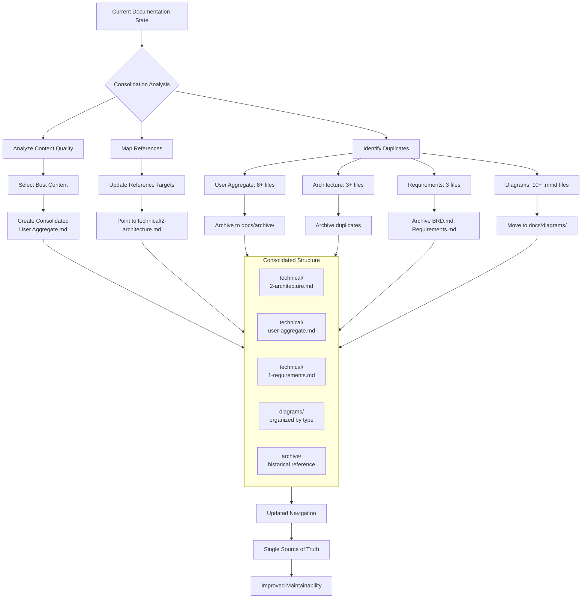

# Documentation Consolidation Plan

## Overview

This plan outlines the consolidation of FurryFriends documentation to eliminate duplication, improve maintainability, and establish a single source of truth for architectural and domain documentation.

### Workflow Diagram



## Current State Analysis

### Identified Duplicates

#### User Aggregate Documentation (8+ files)

**Mermaid Diagram Files:**

- `User Aggregate.mmd` - Primary diagram
- `User Aggregate 1.mmd` - Duplicate diagram
- `User Aggregate 1 (2).mmd` - Duplicate diagram
- `User Aggregate 2.mmd` - Duplicate diagram
- `User Aggregate 3.mmd` - Duplicate diagram

**Markdown Documentation Files:**

- `User Aggregate 2 (3).md` - Text documentation
- `User Aggregate 4.md` - Text documentation
- `User Aggregate Doc 1.md` - Text documentation

**AI-Generated Versions:**

- `Codellama 7b UserAggregate 2.md`
- `Lama3.1 latest 8b UserAggregate 2.md`
- `Ollama Areana Model UserAggregate 2.md`
- `Phi3 14b UserAggregate 2.md`
- `Qwen2.5 3b UserAggregate 2.md`
- `Qwen2.5 7b User Aggregate 2.md`

#### Architecture Documentation

- Primary: `docs/technical/2-architecture.md`
- Redundant: `High-Level Architecture.md`
- Diagram files: `Architecture 1.mmd`, `Architecture 2.mmd`

#### Requirements Documentation

- Primary: `docs/technical/1-requirements.md`
- Redundant: `BRD.md`, `Requirements.md`

#### Mermaid Diagrams

Scattered `.mmd` files throughout docs directory:

- Architecture diagrams
- Component diagrams
- Container diagrams
- C4 models
- User aggregate diagrams
- Logging diagrams

## Consolidation Strategy

### 1. Archive Structure

Create organized archive directories:

```
docs/archive/
├── user-aggregate/
│   ├── diagrams/
│   └── ai-generated/
├── architecture/
├── requirements/
└── diagrams/
```

### 2. Consolidated User Aggregate Documentation

Create new comprehensive file: `docs/technical/user-aggregate.md`

- Combine best content from all duplicates
- Include unified Mermaid diagram
- Structure with clear sections:
  1. Overview and Purpose
  2. Aggregate Structure
  3. Value Objects
  4. Domain Logic
  5. Invariants and Business Rules
  6. Integration Points

### 3. Architecture Reference Updates

Update all documentation to reference `docs/technical/2-architecture.md` as the single source of truth:

- Update `index.md` and other navigation files
- Remove references to `High-Level Architecture.md`
- Archive redundant architecture files

### 4. Diagrams Directory Structure

Create `docs/diagrams/` with organized subdirectories:

```
docs/diagrams/
├── architecture/
├── components/
├── containers/
├── c4-models/
├── domain/
└── sequences/
```

### 5. Standardized Mermaid Diagrams

- Move all `.mmd` files to appropriate subdirectories
- Apply consistent styling and formatting
- Ensure all diagrams follow naming conventions
- Update references in documentation

## Implementation Plan

### Phase 1: Archive Creation and File Movement

1. Create archive directory structure
2. Move duplicate User Aggregate files to archive
3. Archive redundant BRD/Requirements documents
4. Move architecture duplicates to archive

### Phase 2: Consolidated Documentation Creation

1. Analyze all User Aggregate files for best content
2. Create comprehensive `user-aggregate.md`
3. Update navigation and references

### Phase 3: Diagrams Reorganization

1. Create diagrams directory structure
2. Move and categorize all `.mmd` files
3. Standardize diagram formatting
4. Update references in documentation

### Phase 4: Reference Updates

1. Scan all documentation for architecture references
2. Update to point to `technical/2-architecture.md`
3. Update index and navigation files
4. Verify all links work correctly

## Success Criteria

- Single source of truth for User Aggregate documentation
- All architecture references point to `technical/2-architecture.md`
- Redundant files archived with clear organization
- Diagrams centralized in `docs/diagrams/` with consistent formatting
- Navigation updated to reflect new structure
- No broken links in documentation

## Risk Mitigation

- Maintain backup of archived files
- Test all updated links before finalizing
- Keep archive accessible for historical reference
- Update any build/CI documentation references
