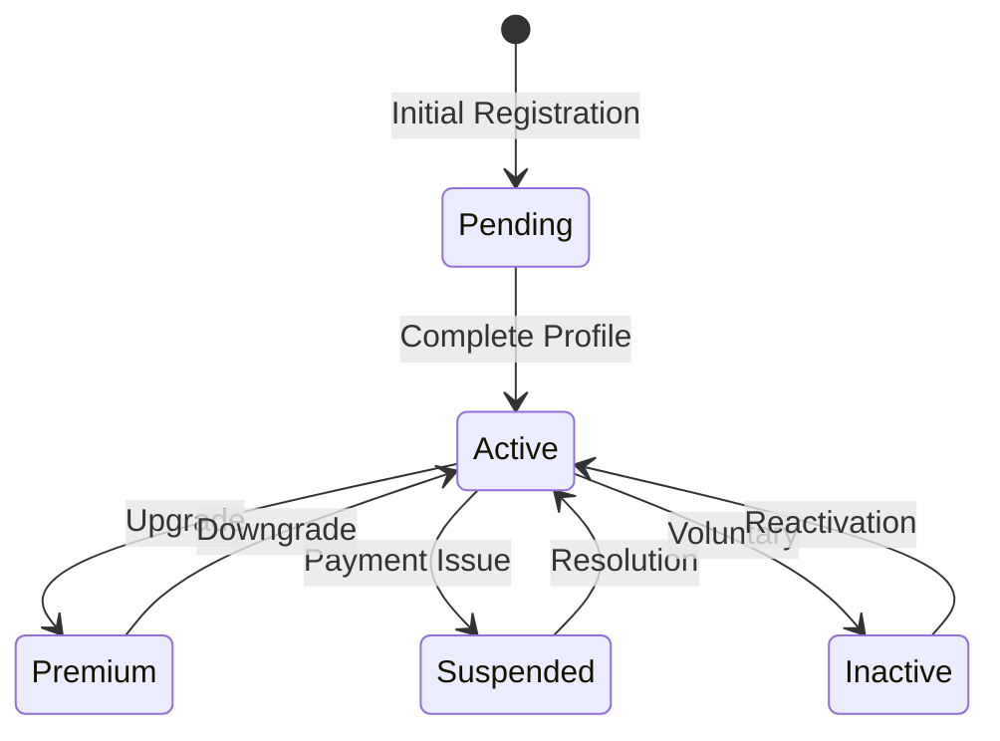
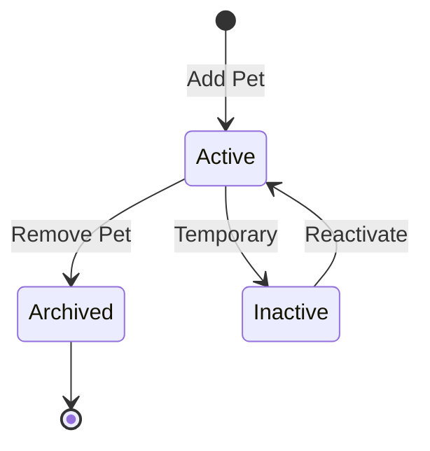
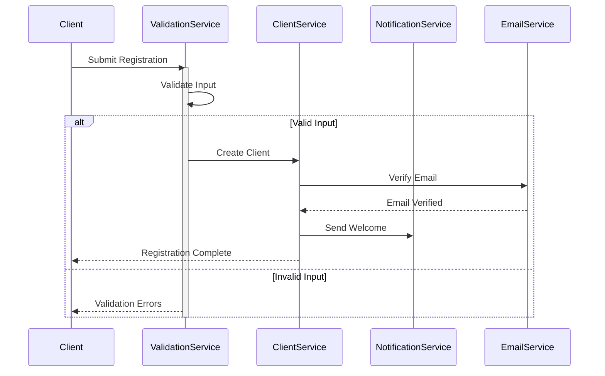
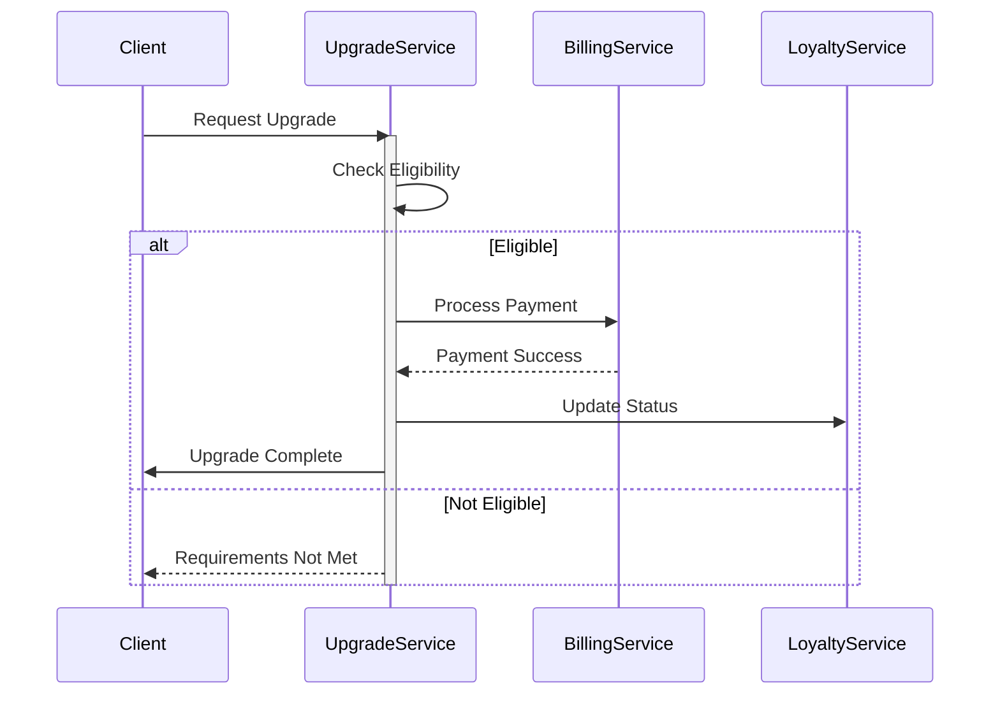

# Client Domain - Architectural Overview

## Domain Model Architecture

### Aggregate Boundaries
The Client aggregate represents a pet owner and serves as the aggregate root, managing:
- Personal identification and contact details
- Pet ownership relationships
- Service history and preferences
- Billing and payment information
- Loyalty status and rewards
- Communication preferences

### Strategic Design Decisions
1. **Rich Domain Model**
   - Value Objects for complex concepts (Address, ContactInfo)
   - Strong entity boundaries around Client-Pet relationship
   - Domain events for significant state changes
   - Encapsulated business rules for pet limits and service eligibility

2. **Invariant Protection**
   - Pet ownership limits
   - Contact information validation
   - Service eligibility rules
   - Upgrade criteria enforcement

3. **Bounded Context Integration**
   - Billing Context: Payment methods, invoicing
   - Scheduling Context: Appointment management
   - Loyalty Context: Points, rewards, tiers
   - Communication Context: Preferences, history

## State Management

### Client Lifecycle States


### Pet Management States


## Business Process Flows

### Client Registration Flow


### Client Upgrade Process


## Implementation Guidelines

### Command Handling Strategy

1. **Client Commands**
   - CreateClient: Initial registration
   - UpdateProfile: Information updates
   - AddPet: Pet management
   - UpgradeClient: Status changes
   - UpdatePreferences: Settings management

2. **Validation Approach**
   - Input validation (FluentValidation)
   - Business rule validation
   - State transition validation
   - Concurrency handling

### Query Handling Strategy

1. **Query Types**
   - GetClient: Single client retrieval
   - ListClients: Filtered client list
   - SearchClients: Advanced search
   - GetClientHistory: Activity tracking

2. **Performance Optimization**
   - Cached client profiles
   - Materialized views
   - Pagination implementation
   - Filter optimization

### Event Handling

1. **Domain Events**
   ```mermaid
   graph TD
       A[ClientCreated] --> B[Welcome Email]
       A --> C[Profile Setup]
       D[ClientUpgraded] --> E[Benefits Activation]
       D --> F[Notification]
       G[PetAdded] --> H[Pet Profile Setup]
       G --> I[Service Recommendations]
   ```

2. **Event Handlers**
   - Profile completeness tracking
   - Loyalty point calculation
   - Communication preferences
   - Service eligibility updates

## Integration Points

### External Systems
1. **Email Service**
   - Welcome messages
   - Verification emails
   - Status notifications
   - Marketing communications

2. **Payment Processing**
   - Payment method management
   - Subscription handling
   - Refund processing
   - Invoice generation

3. **Loyalty System**
   - Point calculation
   - Tier management
   - Reward distribution
   - Benefits tracking

### Internal Services
1. **Pet Management**
   - Pet profile creation
   - Health record linking
   - Service history tracking
   - Vaccination updates

2. **Appointment System**
   - Scheduling integration
   - Availability checking
   - Reminder management
   - History tracking

## Performance Considerations

### Optimization Strategies
1. **Read Operations**
   - Cached client profiles
   - Denormalized views
   - Search optimization
   - Result pagination

2. **Write Operations**
   - Command queueing
   - Batch processing
   - Concurrency management
   - Event sourcing

### Scaling Considerations
1. **Data Partitioning**
   - Geographic partitioning
   - Activity-based sharding
   - Archive strategy
   - Cache distribution

2. **Load Management**
   - Query optimization
   - Command throttling
   - Background processing
   - Resource allocation

## Error Handling and Recovery

### Error Categories
1. **Validation Errors**
   - Input validation
   - Business rule violations
   - State transition errors
   - Concurrency conflicts

2. **System Errors**
   - Integration failures
   - Service unavailability
   - Data consistency issues
   - Resource constraints

### Recovery Strategies
1. **Automatic Recovery**
   - Retry policies
   - Circuit breakers
   - Fallback mechanisms
   - Compensation logic

2. **Manual Intervention**
   - Admin notifications
   - Support tickets
   - Audit logging
   - Resolution workflows