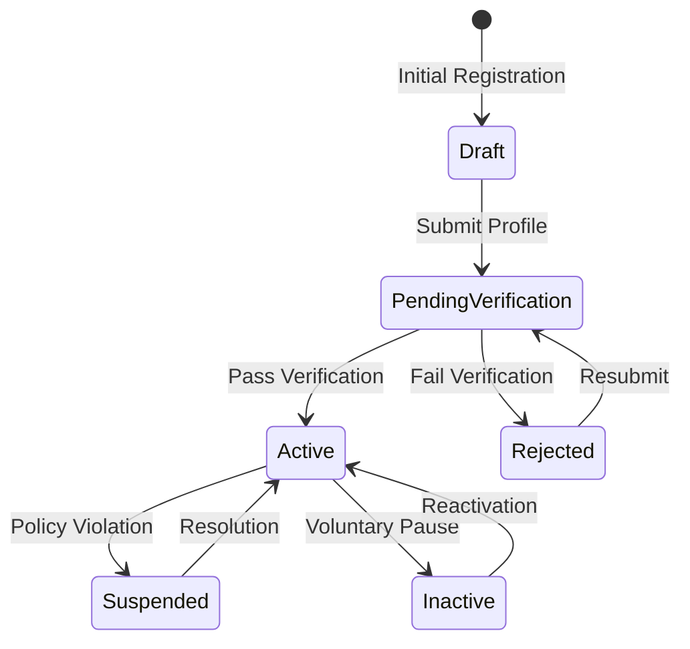
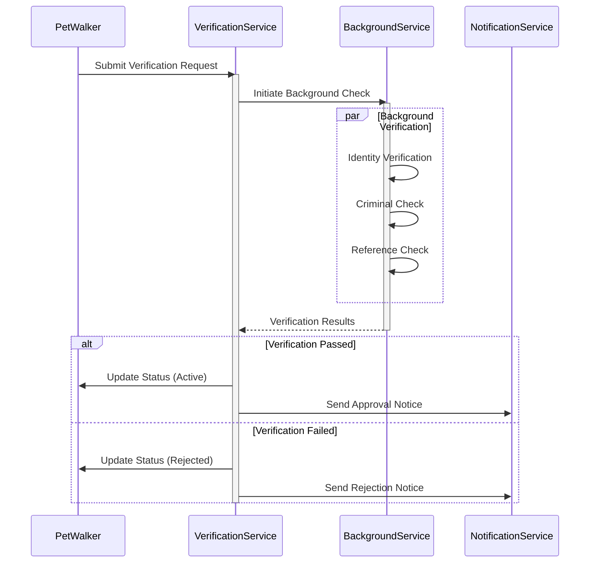
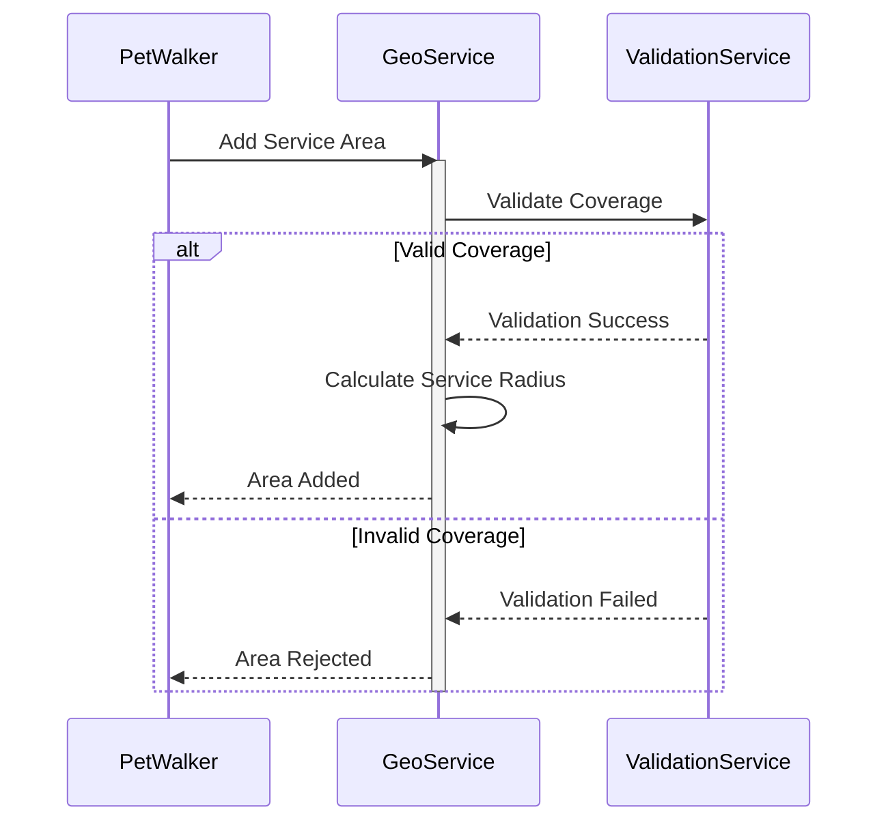

# PetWalker Domain - Architectural Overview

## Domain Model Architecture

### Aggregate Boundaries
The PetWalker aggregate represents a professional pet care provider and serves as the aggregate root, managing:
- Core identity and profile information
- Service area definitions
- Verification status
- Compensation details
- Photo gallery
- Operating parameters (walk limits, availability)

### Strategic Design Decisions
1. **Rich Domain Model**
   - Encapsulates complex business rules within the aggregate
   - Uses value objects for validated concepts (Name, Email, PhoneNumber)
   - Implements domain events for important state changes

2. **Invariant Protection**
   - All state modifications go through validated methods
   - Business rules enforced at the domain level
   - Concurrency protection for critical operations

3. **Bounded Context Integration**
   - Interfaces with Payment context for compensation
   - Connects to Scheduling context for availability
   - Integrates with Verification context for background checks

## State Management

### Lifecycle States

### State Transition Rules
1. **Draft → PendingVerification**
   - Required: Basic profile, photos, service areas
   - Validation: Age, contact information, location

2. **PendingVerification → Active**
   - Required: Background check, certifications, insurance
   - Validation: Document authenticity, reference checks

3. **Active → Suspended**
   - Triggers: Policy violations, customer complaints
   - Actions: Notification, review process initiation

## Business Process Flows

### Verification Process

### Service Area Management

## Implementation Guidelines

### Domain Event Handling Strategy

1. **Critical Events**
   - PetWalkerCreated: Trigger onboarding workflow
   - VerificationStatusChanged: Update service availability
   - ServiceAreaModified: Recalculate coverage maps

2. **Event Handler Responsibilities**
   - Maintain eventual consistency
   - Trigger external integrations
   - Update read models
   - Send notifications

### Validation Strategy

1. **Command Validation**
   - Pre-execution business rule validation
   - Input format and range checking
   - Cross-field validation logic

2. **Domain Validation**
   - Invariant protection
   - State transition rules
   - Business rule enforcement

### Error Handling Patterns

1. **Command Failures**
   - Business rule violations
   - Validation errors
   - Concurrency conflicts

2. **Query Failures**
   - Not found conditions
   - Authorization failures
   - Invalid filter parameters

## Integration Points

### External Services
1. **Background Check Service**
   - Identity verification
   - Criminal record checks
   - Reference validation

2. **Payment Processing**
   - Rate management
   - Payment collection
   - Payout processing

3. **Notification Service**
   - Status updates
   - Verification results
   - Policy notifications

### Internal Systems
1. **Scheduling System**
   - Availability management
   - Booking coordination
   - Capacity planning

2. **Review System**
   - Performance tracking
   - Client feedback
   - Rating calculation

## Performance Considerations

### Optimization Strategies
1. **Query Optimization**
   - Indexed fields: Email, Location, Status
   - Materialized views for common queries
   - Cached reference data

2. **Command Processing**
   - Asynchronous background tasks
   - Batch processing for bulk operations
   - Optimistic concurrency control

### Scaling Considerations
1. **Read Scaling**
   - Separate read models
   - Cached profile data
   - Distributed search indexes

2. **Write Scaling**
   - Command queue management
   - Event sourcing considerations
   - Partition strategy