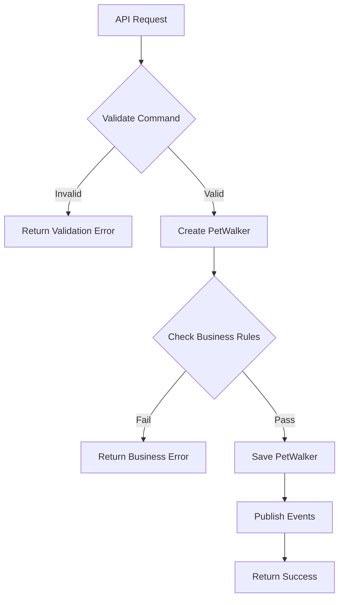
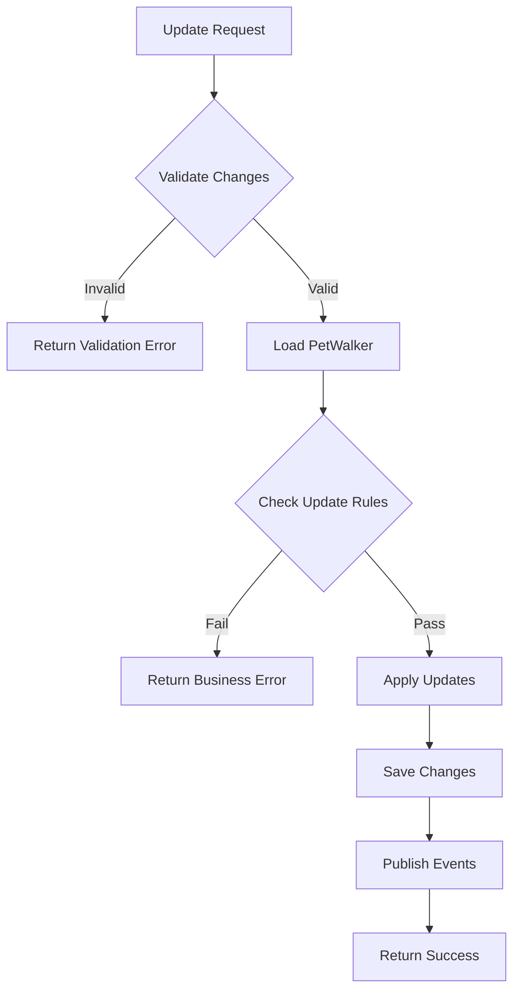
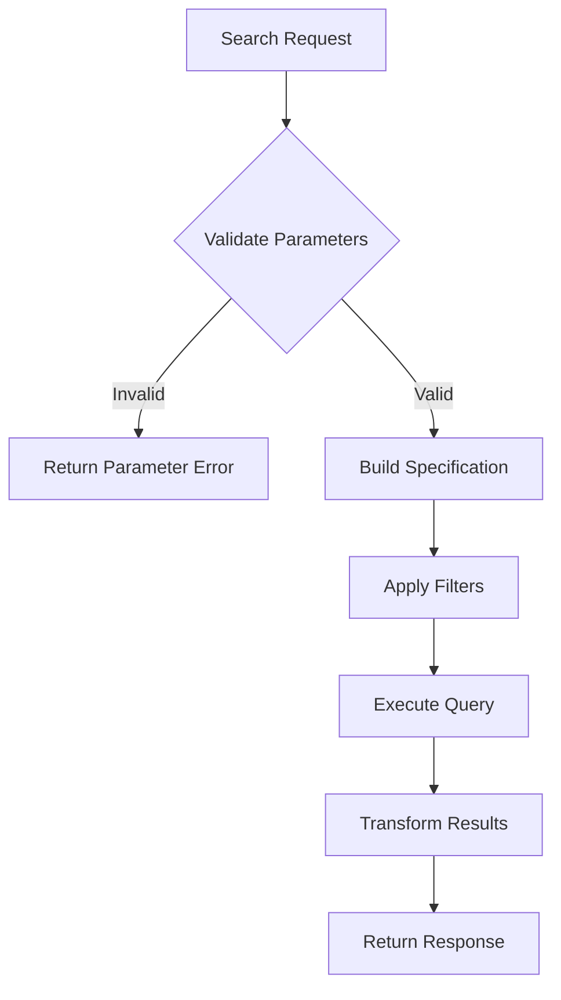

# Implementation Patterns and Best Practices

## Command Pattern Implementation

### Create PetWalker Flow

### Profile Update Flow

## Query Pattern Implementation

### Search and Filter Flow

## Testing Strategy

### Test Categories
1. **Domain Logic Tests**
   - Business rule validation
   - State transitions
   - Event generation

2. **Integration Tests**
   - External service interaction
   - Database operations
   - Event handling

3. **End-to-End Tests**
   - API workflows
   - User scenarios
   - Error handling

## Monitoring and Logging

### Key Metrics
1. **Performance Metrics**
   - Command processing time
   - Query response time
   - External service latency

2. **Business Metrics**
   - Verification success rate
   - Profile completion rate
   - Service area coverage

### Log Levels
1. **INFO**
   - State transitions
   - Profile updates
   - Service area changes

2. **WARNING**
   - Validation failures
   - Business rule violations
   - Retry attempts

3. **ERROR**
   - Command failures
   - Integration errors
   - Data consistency issues