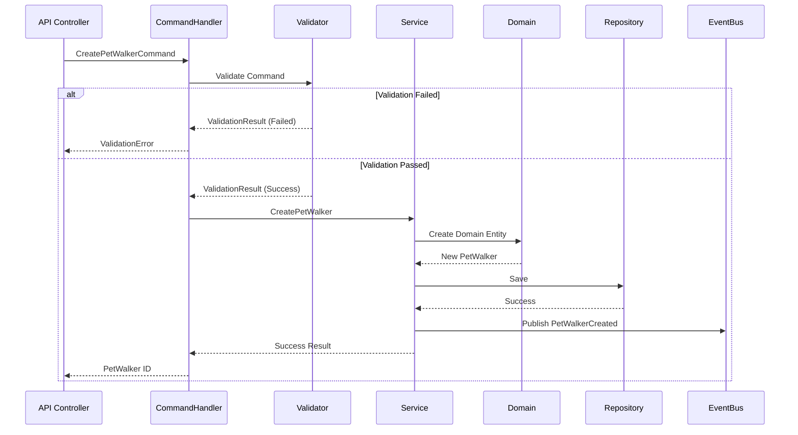
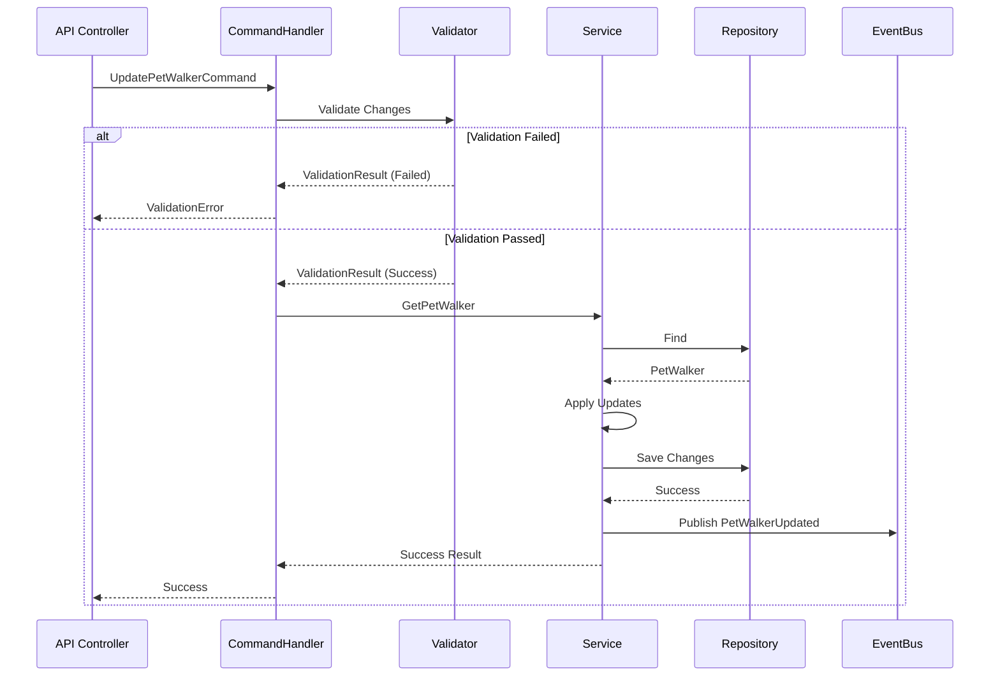
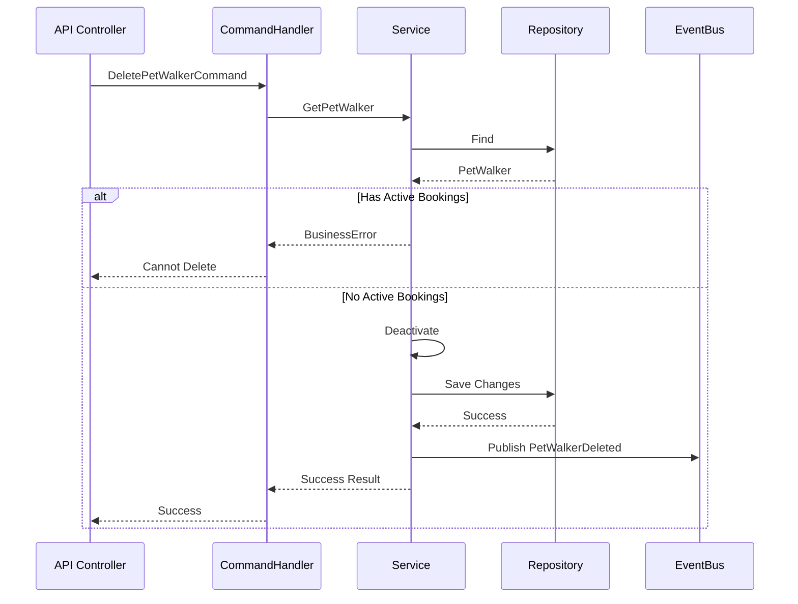
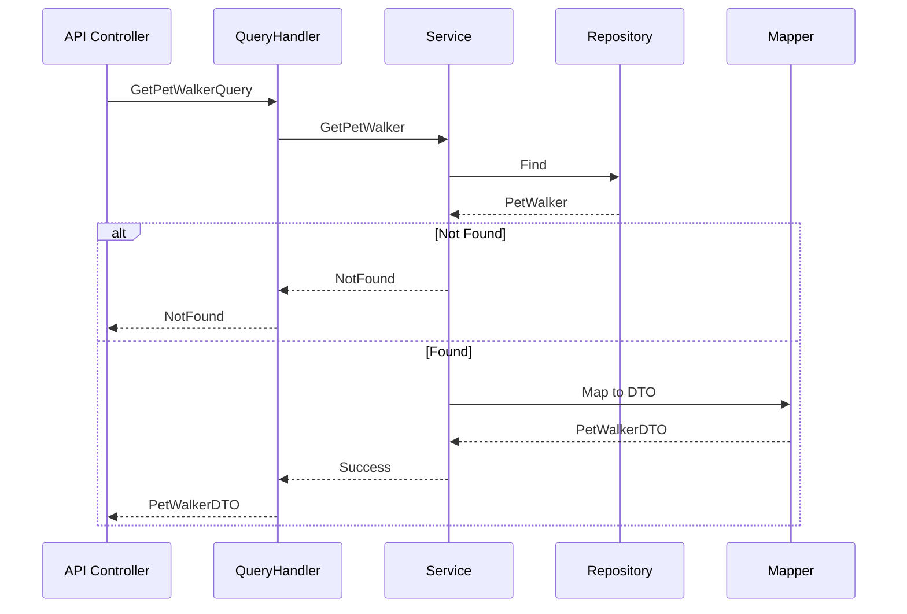
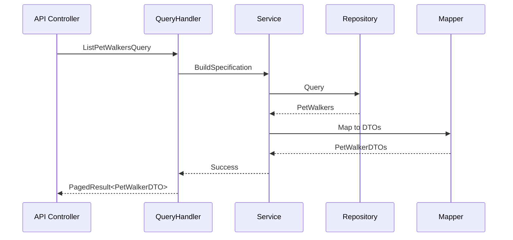
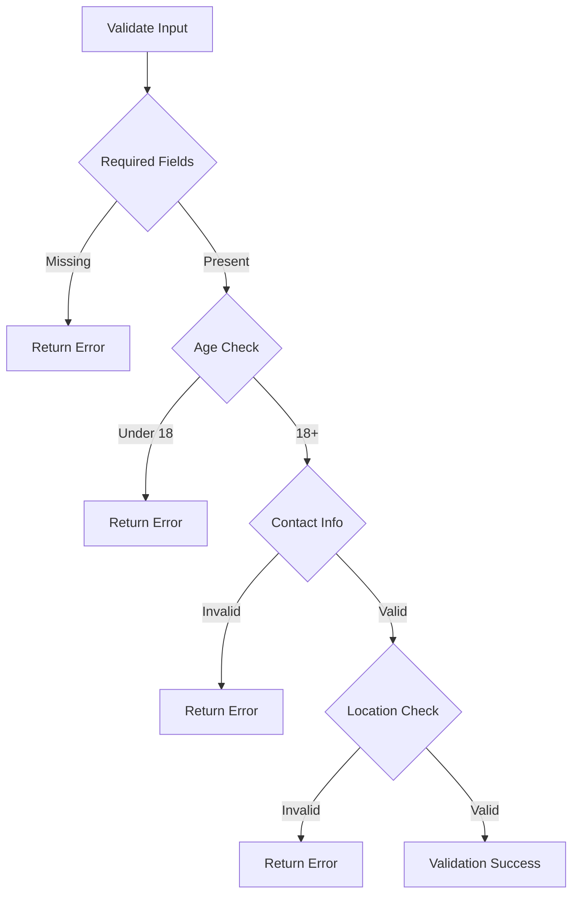
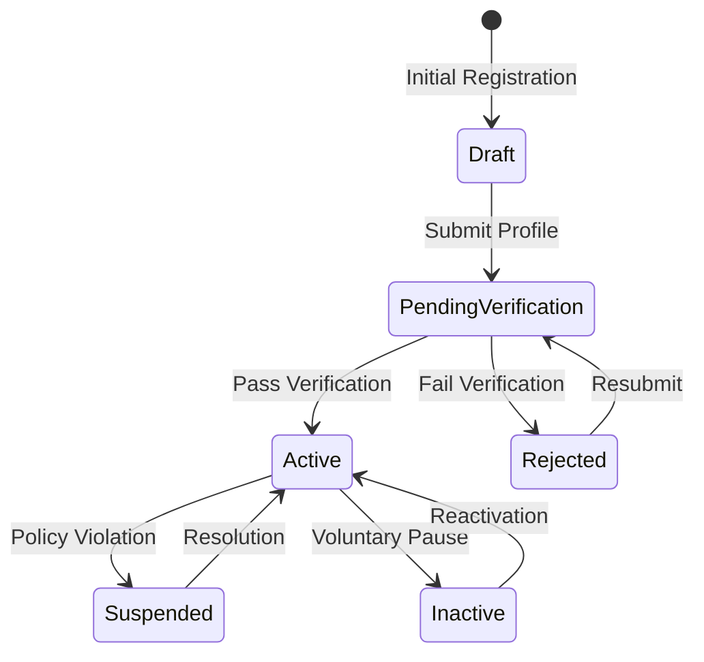

# PetWalker Use Cases Implementation Patterns

## Command Patterns

### Create PetWalker

### Update PetWalker

### Delete PetWalker

## Query Patterns

### Get PetWalker

### List PetWalkers

## Validation Rules

### Create PetWalker Validation

### Business Rules
1. **Age Requirements**
   - Minimum age: 18 years
   - Maximum age: 70 years

2. **Contact Information**
   - Valid email format
   - Valid phone number
   - Verified address

3. **Service Area**
   - Maximum radius: 50 miles
   - Minimum radius: 5 miles
   - Valid zip code coverage

4. **Availability**
   - Maximum daily walks: 8
   - Minimum availability: 10 hours/week
   - Maximum consecutive days: 6

5. **Verification Requirements**
   - Background check
   - Insurance proof
   - First aid certification
   - Photo ID

## State Transitions

## Error Handling

### Error Categories
1. **Validation Errors**
   - Invalid input data
   - Missing required fields
   - Format violations
   - Business rule violations

2. **Business Errors**
   - Insufficient qualifications
   - Service area conflicts
   - Schedule conflicts
   - Verification failures

3. **System Errors**
   - Database failures
   - Integration errors
   - Concurrency conflicts
   - Resource constraints

### Error Recovery
1. **Automatic Recovery**
   - Retry policies
   - Circuit breakers
   - Fallback options
   - Compensation workflows

2. **Manual Intervention**
   - Support notification
   - Admin review
   - User notification
   - Resolution tracking

## Performance Considerations

### Query Optimization
1. **Caching Strategy**
   - Profile data caching
   - Service area caching
   - Availability caching
   - Rating caching

2. **Search Optimization**
   - Location-based indexing
   - Availability indexing
   - Rating indexing
   - Full-text search

### Command Optimization
1. **Batch Processing**
   - Schedule updates
   - Rating calculations
   - Status updates
   - Event processing

2. **Concurrency Handling**
   - Optimistic locking
   - Version tracking
   - Conflict resolution
   - Retry logic