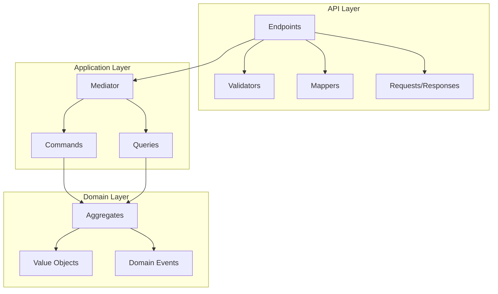
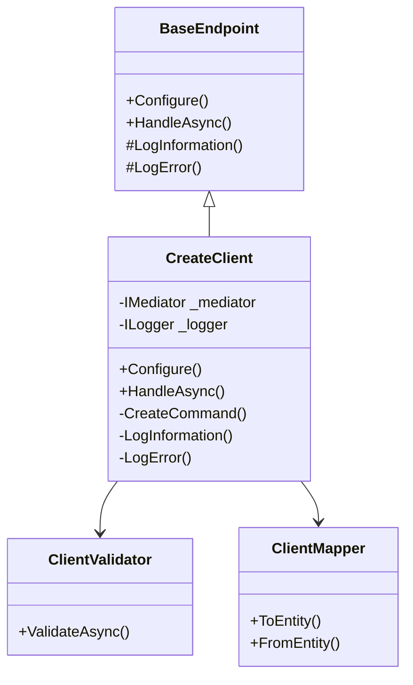
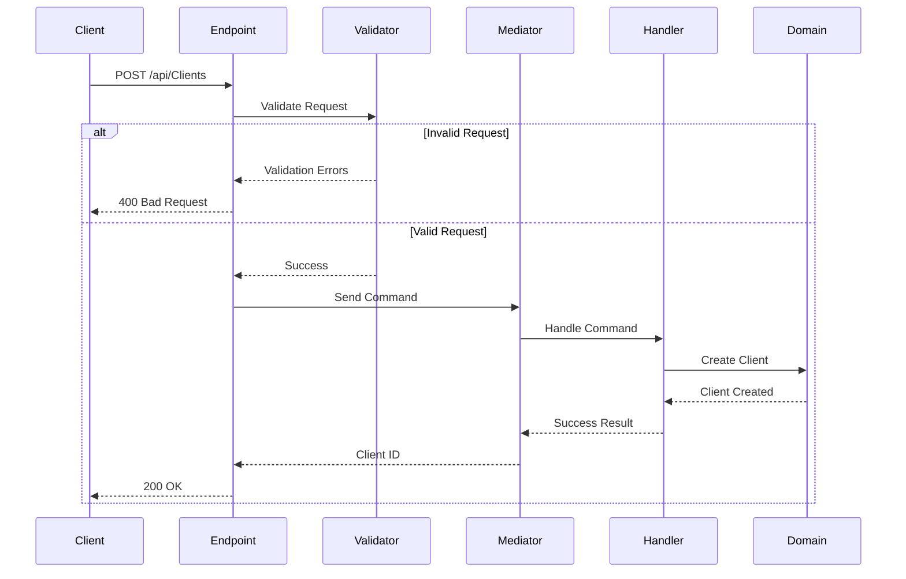
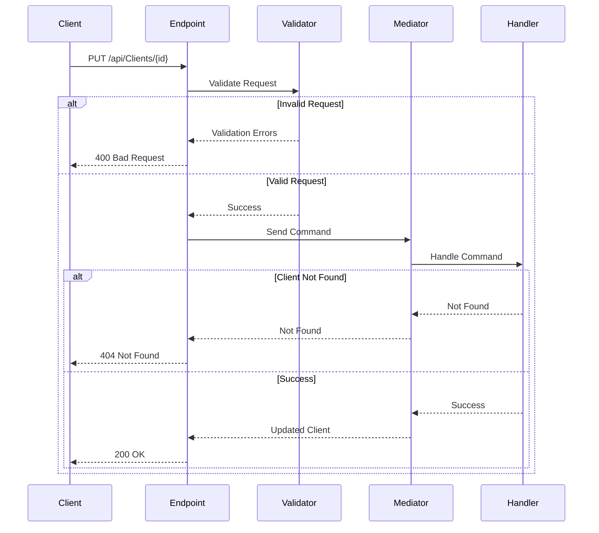
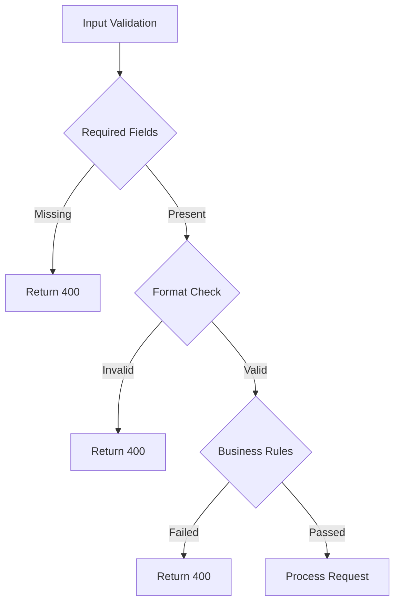
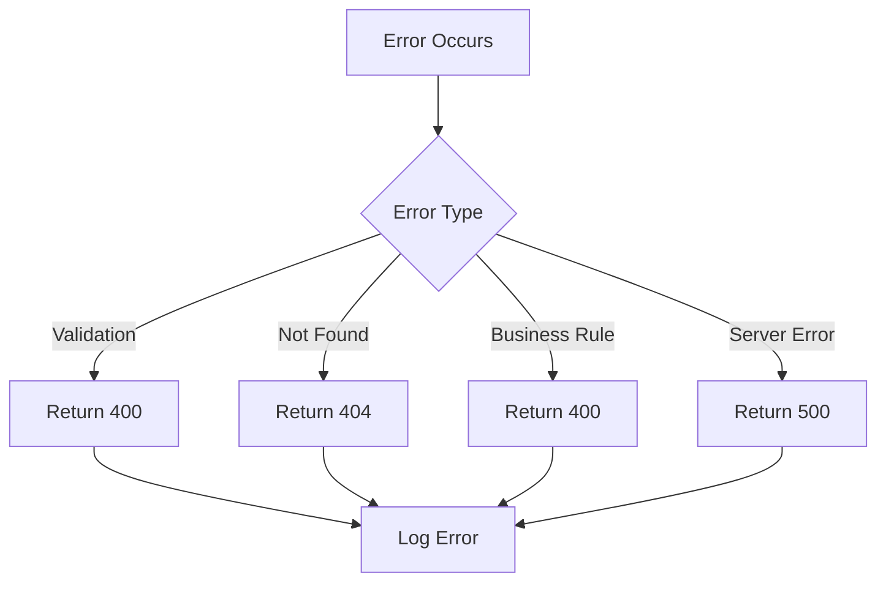
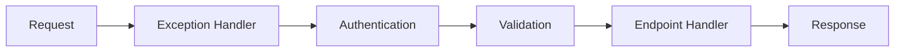

# Client Endpoints Architecture

## Overview

The Client endpoints implement a RESTful API using FastEndpoints, following SOLID principles and clean architecture patterns.



## Endpoint Implementation Pattern



## Endpoint Routes

| Method | Route | Description | Authentication |
|--------|-------|-------------|----------------|
| POST | /api/Clients | Create new client | Anonymous |
| PUT | /api/Clients/{id} | Update client | Anonymous |
| DELETE | /api/Clients/{id} | Delete client | Anonymous |
| GET | /api/Clients/{email} | Get client by email | Anonymous |
| GET | /api/Clients | List clients | Anonymous |

## Create Client Flow



## Update Client Flow



## Validation Rules



### Request Validation Rules
```csharp
// Common validation rules for all client requests
RuleFor(x => x.FirstName).NotEmpty()
RuleFor(x => x.LastName).NotEmpty()
RuleFor(x => x.Email).NotEmpty().EmailAddress()
RuleFor(x => x.PhoneCountryCode).NotEmpty()
RuleFor(x => x.PhoneNumber).NotEmpty()
RuleFor(x => x.Street).NotEmpty()
RuleFor(x => x.City).NotEmpty()
RuleFor(x => x.State).NotEmpty()
RuleFor(x => x.Country).NotEmpty()
RuleFor(x => x.ZipCode).NotEmpty()
```

## Error Handling



### Error Response Format
```json
{
  "type": "https://www.rfc-editor.org/rfc/rfc7231#section-6.5.1",
  "title": "Validation Error",
  "status": 400,
  "errors": [
    {
      "code": "ValidationError",
      "message": "The FirstName field is required"
    }
  ]
}
```

## Middleware Pipeline



## Request/Response Contracts

### Create Client
```csharp
public class CreateClientRequest
{
    public string FirstName { get; set; }
    public string LastName { get; set; }
    public string Email { get; set; }
    public string PhoneCountryCode { get; set; }
    public string PhoneNumber { get; set; }
    public string Street { get; set; }
    public string City { get; set; }
    public string State { get; set; }
    public string Country { get; set; }
    public string ZipCode { get; set; }
    public ClientType ClientType { get; set; }
    public TimeOnly? PreferredContactTime { get; set; }
    public ReferralSource? ReferralSource { get; set; }
}

public class CreateClientResponse
{
    public string ClientId { get; set; }
}
```

## Performance Considerations

1. **Caching Strategy**
   - Response caching for GET endpoints
   - Distributed caching for frequently accessed data
   - Cache invalidation on updates

2. **Query Optimization**
   - Pagination for list endpoints
   - Selective loading of related data
   - Optimized database queries

3. **Validation Performance**
   - Cached validator instances
   - Parallel validation where applicable
   - Early validation termination

## Security Considerations

1. **Input Validation**
   - Sanitize all inputs
   - Validate data types and ranges
   - Prevent injection attacks

2. **Authentication/Authorization**
   - JWT token validation
   - Role-based access control
   - API key validation

3. **Rate Limiting**
   - Per-client rate limits
   - Burst handling
   - DDoS protection