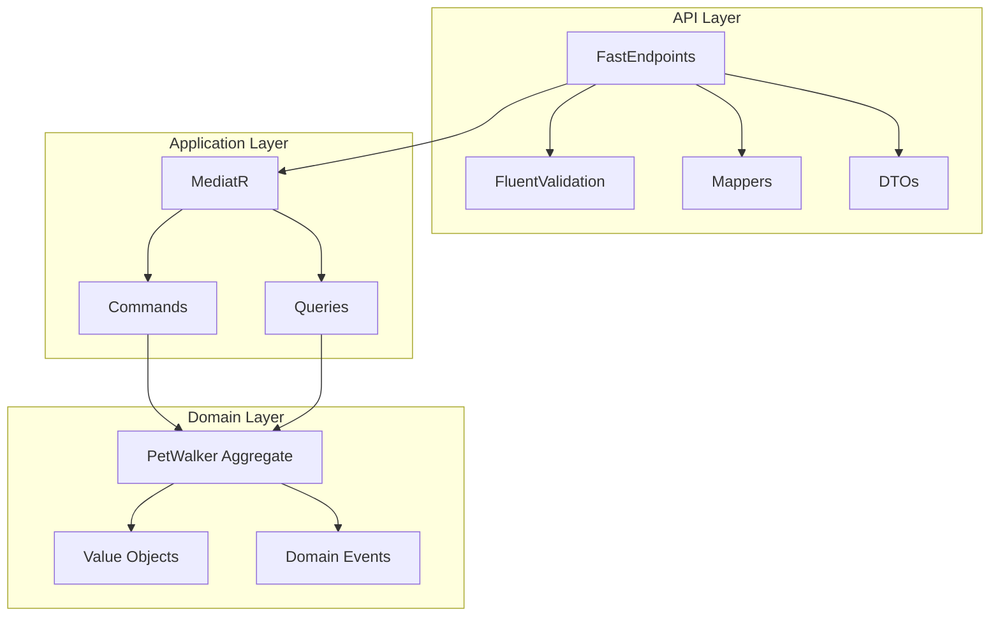
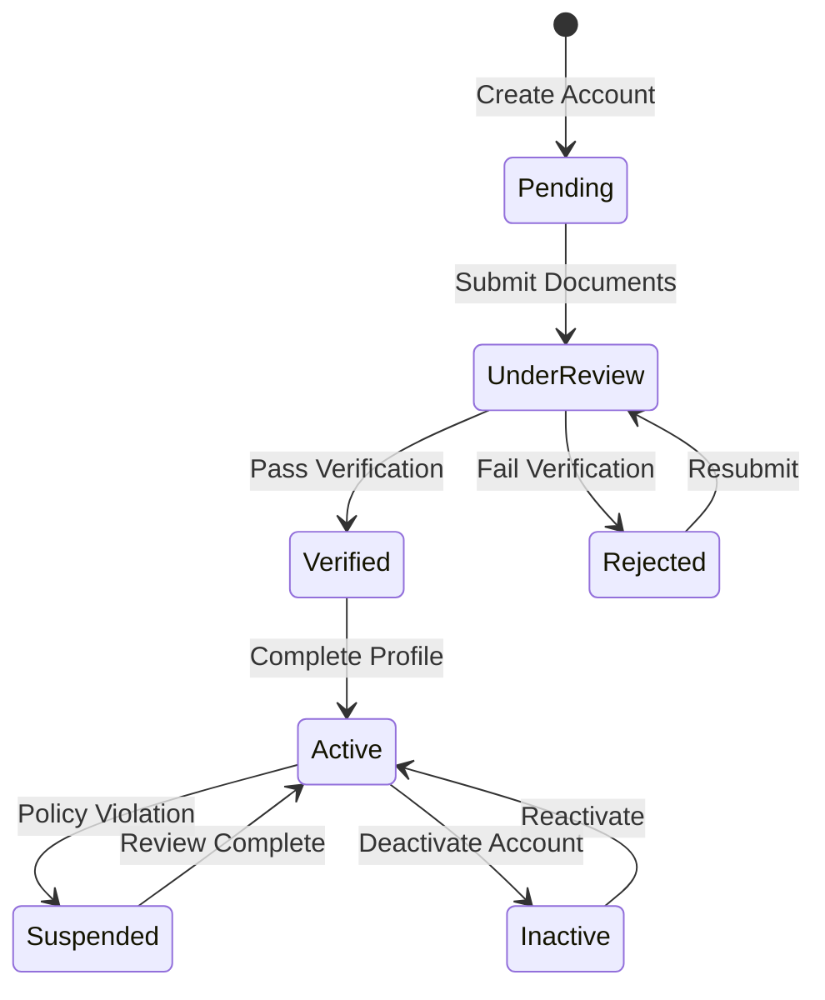

# PetWalker Endpoints Architecture

## Overview

The PetWalker endpoints implement a RESTful API using FastEndpoints, following CQRS pattern with MediatR.

## Endpoint Routes

| Method | Route | Description | Auth Required |
|--------|-------|-------------|---------------|
| POST | /api/pet-walkers | Create new walker | No |
| PUT | /api/pet-walkers/{id}/profile | Update profile | No |
| PUT | /api/pet-walkers/{id}/hourly-rate | Update rate | No |
| POST | /api/pet-walkers/{id}/service-areas | Add service area | No |
| PUT | /api/pet-walkers/{id}/availability | Update availability | No |
| GET | /api/pet-walkers/{id} | Get walker details | No |
| GET | /api/pet-walkers | List walkers | No |
| DELETE | /api/pet-walkers/{id} | Delete walker | No |

## State Machine

