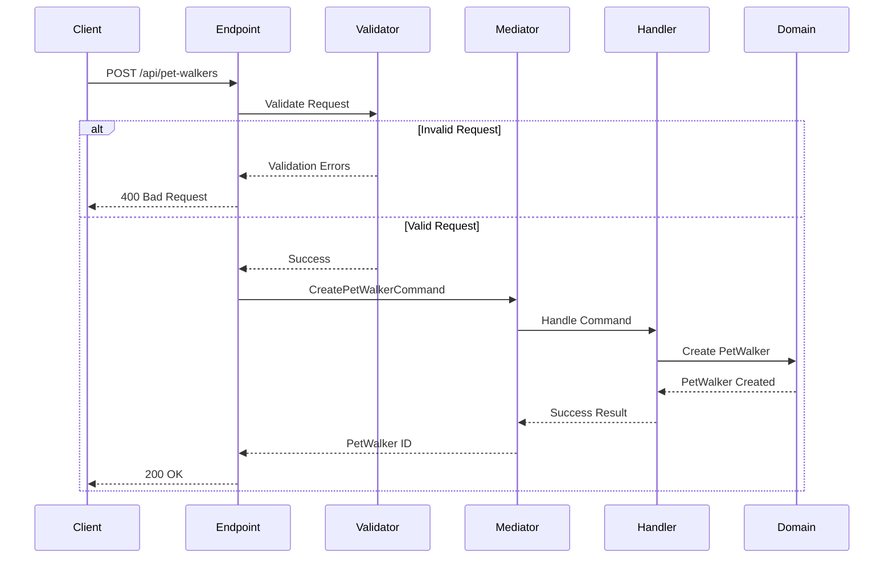

# Create PetWalker Endpoint

## Flow Diagram



## Request Contract
```json
{
  "firstName": "string",
  "lastName": "string",
  "email": "string",
  "phoneNumber": {
    "countryCode": "string",
    "number": "string"
  },
  "address": {
    "street": "string",
    "city": "string",
    "state": "string",
    "country": "string",
    "zipCode": "string"
  },
  "dateOfBirth": "string (yyyy-MM-dd)",
  "gender": "string",
  "biography": "string",
  "hourlyRate": {
    "amount": "decimal",
    "currency": "string"
  }
}
```

## Validation Rules
```csharp
public class CreatePetWalkerValidator : Validator<CreatePetWalkerRequest>
{
    public CreatePetWalkerValidator()
    {
        RuleFor(x => x.FirstName).NotEmpty().MaximumLength(50);
        RuleFor(x => x.LastName).NotEmpty().MaximumLength(50);
        RuleFor(x => x.Email).NotEmpty().EmailAddress();
        RuleFor(x => x.DateOfBirth).Must(BeAtLeast18YearsOld);
        RuleFor(x => x.Biography).MaximumLength(1000);
        RuleFor(x => x.HourlyRate.Amount).GreaterThan(0);
    }
}
```