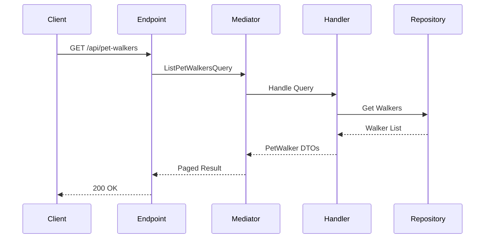

# List PetWalkers Endpoint

## Flow Diagram



## Query Parameters
- page (default: 1)
- pageSize (default: 10)
- location (optional)
- maxHourlyRate (optional)
- availability (optional)
- hasInsurance (optional)
- isVerified (optional)

## Response Contract
```json
{
  "items": [
    {
      "id": "guid",
      "fullName": "string",
      "email": "string",
      "phoneNumber": "string",
      "city": "string",
      "locations": ["string"],
      "bioPicture": {
        "url": "string",
        "description": "string"
      },
      "photos": [
        {
          "url": "string",
          "description": "string"
        }
      ]
    }
  ],
  "totalItems": "number",
  "pageNumber": "number",
  "totalPages": "number"
}
```