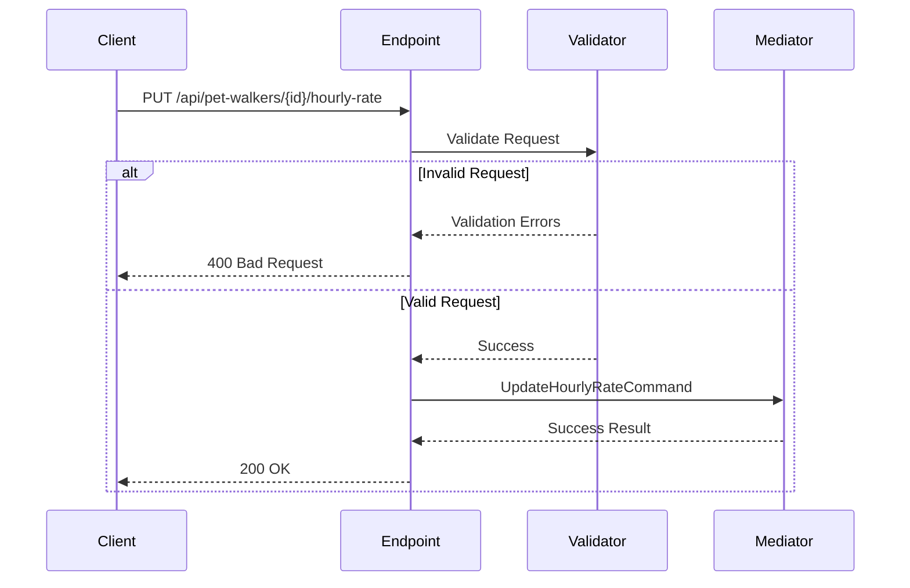

# Update Hourly Rate Endpoint

## Flow Diagram



## Request Contract
```json
{
  "hourlyRate": {
    "amount": "decimal",
    "currency": "string"
  }
}
```

## Validation Rules
```csharp
public class UpdateHourlyRateValidator : Validator<UpdateHourlyRateRequest>
{
    public UpdateHourlyRateValidator()
    {
        RuleFor(x => x.HourlyRate.Amount).GreaterThan(0);
        RuleFor(x => x.HourlyRate.Currency).NotEmpty();
    }
}
```