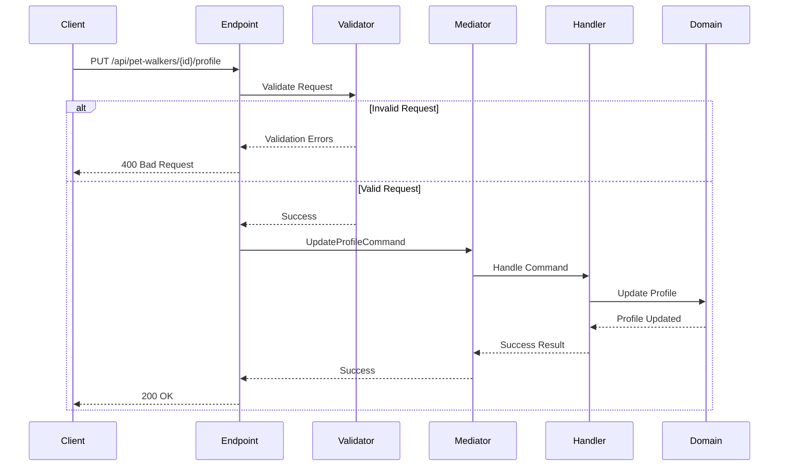

# Update PetWalker Profile Endpoint

## Flow Diagram



## Request Contract
```json
{
  "biography": "string",
  "maxPetsPerWalk": "number",
  "yearsOfExperience": "number",
  "hasInsurance": "boolean",
  "hasFirstAidCertification": "boolean"
}
```

## Validation Rules
```csharp
public class UpdateProfileValidator : Validator<UpdateProfileRequest>
{
    public UpdateProfileValidator()
    {
        RuleFor(x => x.Biography).MaximumLength(1000);
        RuleFor(x => x.MaxPetsPerWalk).InclusiveBetween(1, 5);
        RuleFor(x => x.YearsOfExperience).GreaterThanOrEqualTo(0);
    }
}
```